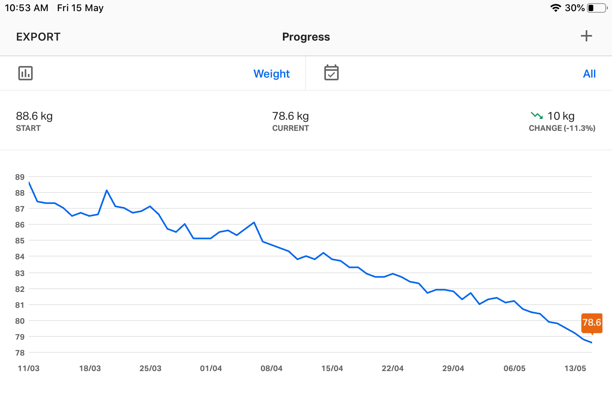

***And here, I (hope to) log my weight-loss journey...***

Something that I could read overtime for my own inspiration. :)

*(The progress will be updated at the top weekly)*

And, just to break the jargons,

- hw: highest weight
- sw: starting weight
- cw: current weight
- gw: goal weight

Okay, let's start:

    - hw: 95.7 kgs (2019/11/21)
    - sw: 93.1 kgs (2020/01/13)

*(for someone who wants to read from the beginning, start [here](https://priyankasaggu11929.github.io/fitness.html#april-11-2019).)*

---

## *June 13, 2020*

    - cw: 75.3 kgs (2020/06/13)

    - gw1: 81 kgs ✔️
    - gw2: 78 kgs ✔️
    - gw3: 75 kgs 
    - gw4: 73 kgs
    - gw5: 70 kgs
    - gw6: 67 kgs

Hahahaha, the early update was a little too early I guess. :P 

But I'm happy I've hit the third goal (and I celebrated as well by updating it here). Because, after logging and tracking for quite good long time, now I'm confident that it's nothing but the diet variations that showed the increase, so it's perfectly fine. It'll go down with time and more consistent work. :)

---

## *June 11, 2020*

**Early update!**

    - cw: 74.9 kgs (2020/06/11)

    - gw1: 81 kgs ✔️
    - gw2: 78 kgs ✔️
    - gw3: 75 kgs ✔️
    - gw4: 73 kgs
    - gw5: 70 kgs
    - gw6: 67 kgs

Hurraaaaah!🎉️🎉️🎉️

Another goal weight down today. Yippeeeeee! 🤩️

This *is* certainly the best thing for the day!🎊️

---

## *June 06, 2020*

    - cw: 76.1 kgs (2020/06/06)

    - gw1: 81 kgs ✔️
    - gw2: 78 kgs ✔️
    - gw3: 75 kgs
    - gw4: 73 kgs
    - gw5: 70 kgs
    - gw6: 67 kgs

Ok, this time I gained some weight! I mean although just 100gms from last saturday. But I gained a lot over the *very early update* I very fondly left here in the very beginning of this week. XD

Reason?

The dietician asked me to *add a little* to my current diet because all this while, I was eating much less than required. And that is why, I'm okay with this little weight gain.

But there is something good about this. I actually gained muscles this time. So, it's an almost win for me. :)

*(ok, honestly, I feel bad when the number increases on the scale. But I've learnt now, taking shortcuts are not good for long term (atleast in this weight loss journey). Only the steady & slow weight loss will thrive. So, HAVE SOME PATIENCE PRIYANKA! )*

---

## *May 31, 2020*

**Very early update!**

    - cw: 75.6 kgs (2020/05/31)

    - gw1: 81 kgs ✔️
    - gw2: 78 kgs ✔️
    - gw3: 75 kgs
    - gw4: 73 kgs
    - gw5: 70 kgs
    - gw6: 67 kgs

Yipeeeee 🎉️ 🎉️ 🎉️

I'm 20.1 kgs down from the highest weight today. 🤩️

It was just an impossible, unreal dream, an year back. I am sooooo happy right now. 😁️ 

---

## *May 30, 2020*

    - cw: 76.0 kgs (2020/05/30)

    - gw1: 81 kgs ✔️
    - gw2: 78 kgs ✔️
    - gw3: 75 kgs
    - gw4: 73 kgs
    - gw5: 70 kgs
    - gw6: 67 kgs

A good steady weight loss, I'm 1.3 kgs down from last week.

Although, I'm realising, I might have to work beyond the goals later. My muscle loss is something that is bothering me right now. Have to check with dietician about this, but later. Right now the focus is to reduce fat.

Btw, metabolic age turns down to 27 today. Now, 5 more years to go. XD

---

## *May 23, 2020*

    - cw: 77.3 kgs (2020/05/23)

    - gw1: 81 kgs ✔️
    - gw2: 78 kgs ✔️
    - gw3: 75 kgs
    - gw4: 73 kgs
    - gw5: 70 kgs
    - gw6: 67 kgs

Lost 1.1 kgs since last week. The slope is mostly downwards and that *is* how I'm hoping it to be.

I'll keep doing my work & I'll keep showing up here. Now that, my own logs are turning to be *my* source of inspiration, I feel even more obliged to keep doing my work. :)

---

## *May 21, 2020*

**Mid-week update!**

    - cw: 77.8 kgs (2020/05/21)

    - gw1: 81 kgs ✔️
    - gw2: 78 kgs ✔️
    - gw3: 75 kgs
    - gw4: 73 kgs
    - gw5: 70 kgs
    - gw6: 67 kgs

Yipeee! \o/

Knocked down my second goal weight today. And my metabolic age on scale also turned down to 28. I am double happy. :D

Although, I have a long journey yet to cover, I've come a long way since november last year. :)

---

## *May 17, 2020*

The *Subcutaneous Fat(%)* turned to *Normal* today. And that becomes my first *red to green* slide. 🎉️

---

## *May 16, 2020*

    - cw: 78.4 kgs (2020/05/16)

    - gw1: 81 kgs ✔️
    - gw2: 78 kgs
    - gw3: 75 kgs
    - gw4: 73 kgs
    - gw5: 70 kgs
    - gw6: 67 kgs

This week marked the best progress so far. I lost 2 kilos of weight in a week. And also came much close to my second goal weight.

I am happy! :)

And now, I'm even more motivated to keep doing my work! \o/

---

## *May 15, 2020*

**Early update!**

    - cw: 78.6 kgs (2020/05/15)

    - gw1: 81 kgs ✔️
    - gw2: 78 kgs
    - gw3: 75 kgs
    - gw4: 73 kgs
    - gw5: 70 kgs
    - gw6: 67 kgs

*(The weight loss is uncertain. Who knows if the number goes up again. So, I decided to celebrate today's victory today itself.)*

I've lost 10kgs from the day I came back home in March (due to the lockdown). Which also means, I'm 14.5 kgs down from the starting weight & 17.1 kgs down from the highest weight (from nov, 2019).

These number makes me super proud of myself today.🙂️

* This is much much mucccch more than the highest weight I have ever lost in one go before.*

In additon, my metabolic age on scale also slid down by 1. So, 29 from 30 now. It actually took me almost 7 months to get this number down by 1 today. :)

---

## *May 9, 2020*

    - cw: 80.4 kgs (2020/05/09)

    - gw1: 81 kgs ✔️
    - gw2: 78 kgs
    - gw3: 75 kgs
    - gw4: 73 kgs
    - gw5: 70 kgs
    - gw6: 67 kgs

Ok'ish week.

600gms down from last week. But it was a *veeeeery slow process* this time. 

Although, a good thing happened. I slid down to *Overweight* range from *too high*. I mean I'm still overweight but that is much much much better than falling above that.

That's all. No good progress in the exercise. I think my body needs more rest & energy than I'm getting these days.

*I'm realising everyday that I need to be really patient on this journey.*

---

## *May 2, 2020*

    - cw: 81.0 kgs (2020/05/02)

    - gw1: 81 kgs ✔️
    - gw2: 78 kgs
    - gw3: 75 kgs
    - gw4: 73 kgs
    - gw5: 70 kgs
    - gw6: 67 kgs

Here I go! (lost 1.3 kgs) 🎉️

Yesterday, (even after a gradual weight loss throughout the week) I gained a good odd 600gms of weight, which eventually made me lose all my hope for achieving the first gw today.

But it happened *today* and I'm very happy about it. :)

*TIL, how good it is to divide the journey into multiple small milestones. If it wasn't the first milestone, I wouldn't have acknowledged my own efforts. *

Anyways, a very bad record of exercise this week (2/7 if I do it today). I was super lethargic all throughout the week due to poor sleeping hours or I don't know what.
 
***Ok, no more excuses now. I will do better this week. :)***

---

## *April 25, 2020*

    - cw: 82.3 kgs (2020/04/25)

    - gw1: 81 kgs
    - gw2: 78 kgs
    - gw3: 75 kgs
    - gw4: 73 kgs
    - gw5: 70 kgs
    - gw6: 67 kgs

It was a *total* frustrating week. I'm trying to be more patient with the process though. 

Lost a kilo weight, accompanied by muscle loss & just a little fat loss. And I missed 2 days of exercise, so that counts for 5/7. Really need to work more towards being consistent.

---

## *April 18, 2020*

    - cw: 83.3 kgs (2020/04/18)

    - gw1: 81 kgs
    - gw2: 78 kgs
    - gw3: 75 kgs
    - gw4: 73 kgs
    - gw5: 70 kgs
    - gw6: 67 kgs

Some fat loss, some muscle gain and I'm half a kilo down too. That's exactly how I want it to happen. 

And the best part, I didn't miss my 15-20 min exercise at all. \o/

---

## *April 11, 2019*

    - cw: 83.8 kgs (2020/04/11)

    - gw1: 81 kgs
    - gw2: 78 kgs
    - gw3: 75 kgs
    - gw4: 73 kgs
    - gw5: 70 kgs
    - gw6: 67 kgs

A good week, I managed to loose 1.3 kgs. So, from 85.1 kgs to 83.8 today!

***

*A big thanks to **[jasonbraganza](https://janusworx.com/)** because I copied this idea (and even the pattern) from his [super inspiring journey](https://ele.janusworx.com/@jason/103395142013327506).*
