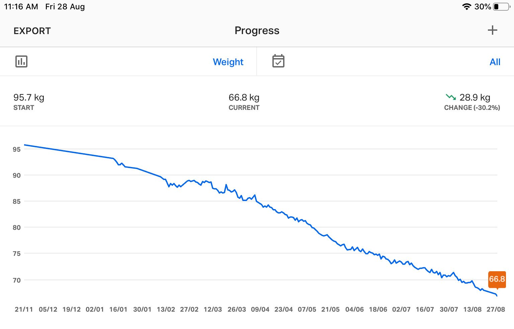

***And here, I (hope to) log my weight-loss journey...***

Something that I could read overtime for my own inspiration. :)

*(The progress will be updated at the top weekly)*

And, just to break the jargons,

- hw: highest weight
- sw: starting weight
- cw: current weight
- gw: goal weight

Okay, let's start:

    - hw: 95.7 kgs (2019/11/21)
    - sw: 93.1 kgs (2020/01/13)

*(for someone who wants to read from the beginning, start [here](https://priyankasaggu11929.github.io/fitness.html#april-11-2019).)*

---

## *Oct 03, 2020*

    - cw: 62.8 kgs (2020/10/03)

    - gw1: 64 kgs ✔️
    - gw2: 61 kgs 
    - gw3: 58 kgs 
    - gw4: 55 kgs 

Feeling fit!

The metabolic age has turned down to 19 (and so, this is the also the first time when my body has actually felt like a teenager's, in years).

---

## *Sept 26, 2020*

    - cw: 64.0 kgs (2020/09/26)

    - gw1: 64 kgs ✔️
    - gw2: 61 kgs 
    - gw3: 58 kgs 
    - gw4: 55 kgs 

Second run, first goal weight down! Progress! 🎉️ 

---

## *Sept 21, 2020*

    - cw: 65.4 kgs (2020/09/21)

    - gw1: 64 kgs 
    - gw2: 61 kgs 
    - gw3: 58 kgs 
    - gw4: 55 kgs 

Slow progress, but good progress!

---

## *Sept 14, 2020*

    - cw: 66.5 kgs (2020/09/14)

    - gw1: 64 kgs 
    - gw2: 61 kgs 
    - gw3: 58 kgs 
    - gw4: 55 kgs 

Gained a kilo over the last week (but I got to eat potatoes, so fine :joy: )!

---

## *Sept 09, 2020*

    - cw: 65.5 kgs (2020/09/09)

    - gw1: 64 kgs 
    - gw2: 61 kgs 
    - gw3: 58 kgs 
    - gw4: 55 kgs 

30+ kgs down from the HW!

---

## *Aug 28, 2020*

    - cw: 66.8 kgs (2020/08/28)

    - gw1: 81 kgs ✔️
    - gw2: 78 kgs ✔️
    - gw3: 75 kgs ✔️
    - gw4: 73 kgs ✔️
    - gw4: 70 kgs ✔️
    - gw4: 67 kgs ✔️

**First Run - Fin!**

**I'm no longer *obese*, no more *overweight*.**

**I'M FINALLY *NORMAL*!**

**It was not just a *weight loss* journey for me, I am *mentally transformed*. I'm really happy & relieved right now! I'm loving myself!**

---

Although, it's not the end here, there is still more to go for me. 

Now that the first bigger milestone is achieved, I will move towards getting into the ideal weight range for me.

*And so, here I start with my second run...*

    - cw: 66.8 kgs (2020/08/28)

    - gw1: 64 kgs 
    - gw2: 61 kgs 
    - gw3: 58 kgs 
    - gw4: 55 kgs 

But once again, you did really ***awesome***, Priyanka!

---

## *Aug 22, 2020*

    - cw: 67.5 kgs (2020/08/22)

    - gw1: 81 kgs ✔️
    - gw2: 78 kgs ✔️
    - gw3: 75 kgs ✔️
    - gw4: 73 kgs ✔️
    - gw4: 70 kgs ✔️
    - gw6: 67 kgs

Closer! :)

---

## *Aug 16, 2020*

    - cw: 68.4 kgs (2020/08/16)

    - gw1: 81 kgs ✔️
    - gw2: 78 kgs ✔️
    - gw3: 75 kgs ✔️
    - gw4: 73 kgs ✔️
    - gw4: 70 kgs ✔️
    - gw6: 67 kgs

More Progress! 900 gms down this week, and getting closer to the target! :)

---

## *Aug 09, 2020*

    - cw: 69.3 kgs (2020/08/09)

    - gw1: 81 kgs ✔️
    - gw2: 78 kgs ✔️
    - gw3: 75 kgs ✔️
    - gw4: 73 kgs ✔️
    - gw4: 70 kgs ✔️
    - gw6: 67 kgs

This week marked good progress. I lost 1.4 kgs of weight, in total.

---

## *Aug 05, 2020*

**Early update!**

    - cw: 69.8 kgs (2020/08/05)

    - gw1: 81 kgs ✔️
    - gw2: 78 kgs ✔️
    - gw3: 75 kgs ✔️
    - gw4: 73 kgs ✔️
    - gw4: 70 kgs ✔️
    - gw6: 67 kgs

Hurraahh! 🎉️ 🎊️ ğŸ˜ï¸

Another goal weight down, which means I'm really close to my final goal weight now (for this first run!)

And guess what, I'm 23 in my metabolic age, which in a way is my current age (but ok, I'm still 22, so couple more months :D).

But yea, keep it up, Priyanka!

---

## *Aug 01, 2020*

    - cw: 70.7 kgs (2020/08/01)

    - gw1: 81 kgs ✔️
    - gw2: 78 kgs ✔️
    - gw3: 75 kgs ✔️
    - gw4: 73 kgs ✔️
    - gw5: 70 kgs
    - gw6: 67 kgs

It increased by 500gms this week. I'm just being patient with the process while enjoying what I've managed to achieve so far. :)

---

## *July 26, 2020*

    - cw: 70.2 kgs (2020/07/26)

    - gw1: 81 kgs ✔️
    - gw2: 78 kgs ✔️
    - gw3: 75 kgs ✔️
    - gw4: 73 kgs ✔️
    - gw5: 70 kgs
    - gw6: 67 kgs

So close to the next goal weight... :D

Although, I cheated a bit. The updates are from sunday this time (not the usual saturday) :P.

---

## *July 18, 2020*

    - cw: 71.5 kgs (2020/07/18)

    - gw1: 81 kgs ✔️
    - gw2: 78 kgs ✔️
    - gw3: 75 kgs ✔️
    - gw4: 73 kgs ✔️
    - gw5: 70 kgs
    - gw6: 67 kgs

More progress!

The metabolic age is 24 now, so, 2 more years left to knock down. (*ah actually, 1 year & 3 months*).

I'm really happy. :)

PS: I've updated it the next day actually. So, today's weight is 71.3 kgs. :D

---

## *July 11, 2020*

    - cw: 72.1 kgs (2020/07/11)

    - gw1: 81 kgs ✔️
    - gw2: 78 kgs ✔️
    - gw3: 75 kgs ✔️
    - gw4: 73 kgs ✔️
    - gw5: 70 kgs
    - gw6: 67 kgs

There is progress!

And I need to be really patient here!

---

## *July 04, 2020*

    - cw: 72.9 kgs (2020/07/04)

    - gw1: 81 kgs ✔️
    - gw2: 78 kgs ✔️
    - gw3: 75 kgs ✔️
    - gw4: 73 kgs ✔️
    - gw5: 70 kgs
    - gw6: 67 kgs

Plateau!

For the whole week, it went going up & down (around 73)!

---

## *June 27, 2020*

    - cw: 73.2 kgs (2020/06/27)

    - gw1: 81 kgs ✔️
    - gw2: 78 kgs ✔️
    - gw3: 75 kgs ✔️
    - gw4: 73 kgs 
    - gw5: 70 kgs
    - gw6: 67 kgs

Ok, I knew it that it will go up (so, I'm happy, I had my early updates put down here yesterday!:D).

And yea, that's all about it. I'm putting the current ones, first to keep my saturday updates streak going, and secondly & most importantly, to be honest with my progress journey!

---

## *June 26, 2020*

**Just an early update!**

    - cw: 73 kgs (2020/06/26)

    - gw1: 81 kgs ✔️
    - gw2: 78 kgs ✔️
    - gw3: 75 kgs ✔️
    - gw4: 73 kgs ✔️
    - gw5: 70 kgs
    - gw6: 67 kgs

More hurraaaaah!🎉️🎉️🎉️

Another goal weight down! ğŸ˜ï¸

It's just a day earlier than my regular saturday updates. But who knows, if it goes up tomorrow. So, marking it here to celebrate my progress today itself! 😊️

And the metabolic age counts 25 today. So, just 3 more years left to go down!

---

## *June 20, 2020*

    - cw: 73.9 kgs (2020/06/20)

    - gw1: 81 kgs ✔️
    - gw2: 78 kgs ✔️
    - gw3: 75 kgs ✔️
    - gw4: 73 kgs
    - gw5: 70 kgs
    - gw6: 67 kgs

Here you go, girl! 🎉️🤩️

So, while today I crossed the *third goal weight* milestone ([again](https://priyankasaggu11929.github.io/fitness.html#june-13-2020) XD), I've come closer to *the fourth one* too. And this makes me so happy, that for a moment, I forgot all my other tensions, stressful things in the life. 🙂️

There's yet a long way for me to actually touch the final goal weight, but at this point of time, I'm no longer afraid to face people in real life. I'm much comfortable with my body, with the way I look. I'm happier than ever before! 😊️

I really worked hard for it & I *myself appreciate* all my efforts now. ❤️ 

---

## *June 18, 2020*

Today, I age 26 on the scale, in terms of my metabolic age. So, 4 more years left to knock down now. :)

---

## *June 13, 2020*

    - cw: 75.3 kgs (2020/06/13)

    - gw1: 81 kgs ✔️
    - gw2: 78 kgs ✔️
    - gw3: 75 kgs 
    - gw4: 73 kgs
    - gw5: 70 kgs
    - gw6: 67 kgs

Hahahaha, the early update was a little too early I guess. :P 

But I'm happy I've hit the third goal (and I celebrated as well by updating it here). Because, after logging and tracking for quite good long time, now I'm confident that it's nothing but the diet variations that showed the increase, so it's perfectly fine. It'll go down with time and more consistent work. :)

Overall, the week was a nice productive one! :)

---

## *June 11, 2020*

**Early update!**

    - cw: 74.9 kgs (2020/06/11)

    - gw1: 81 kgs ✔️
    - gw2: 78 kgs ✔️
    - gw3: 75 kgs ✔️
    - gw4: 73 kgs
    - gw5: 70 kgs
    - gw6: 67 kgs

Hurraaaaah!🎉️🎉️🎉️

Another goal weight down today. Yippeeeeee! 🤩️

This *is* certainly the best thing for the day!🎊️

---

## *June 06, 2020*

    - cw: 76.1 kgs (2020/06/06)

    - gw1: 81 kgs ✔️
    - gw2: 78 kgs ✔️
    - gw3: 75 kgs
    - gw4: 73 kgs
    - gw5: 70 kgs
    - gw6: 67 kgs

Ok, this time I gained some weight! I mean although just 100gms from last saturday. But I gained a lot over the *very early update* I very fondly left here in the very beginning of this week. XD

Reason?

The dietician asked me to *add a little* to my current diet because all this while, I was eating much less than required. And that is why, I'm okay with this little weight gain.

But there is something good about this. I actually gained muscles this time. So, it's an almost win for me. :)

*(ok, honestly, I feel bad when the number increases on the scale. But I've learnt now, taking shortcuts are not good for long term (atleast in this weight loss journey). Only the steady & slow weight loss will thrive. So, HAVE SOME PATIENCE PRIYANKA! )*

---

## *May 31, 2020*

**Very early update!**

    - cw: 75.6 kgs (2020/05/31)

    - gw1: 81 kgs ✔️
    - gw2: 78 kgs ✔️
    - gw3: 75 kgs
    - gw4: 73 kgs
    - gw5: 70 kgs
    - gw6: 67 kgs

Yipeeeee 🎉️ 🎉️ 🎉️

I'm 20.1 kgs down from the highest weight today. 🤩️

It was just an impossible, unreal dream, an year back. I am sooooo happy right now. ğŸ˜ï¸ 

---

## *May 30, 2020*

    - cw: 76.0 kgs (2020/05/30)

    - gw1: 81 kgs ✔️
    - gw2: 78 kgs ✔️
    - gw3: 75 kgs
    - gw4: 73 kgs
    - gw5: 70 kgs
    - gw6: 67 kgs

A good steady weight loss, I'm 1.3 kgs down from last week.

Although, I'm realising, I might have to work beyond the goals later. My muscle loss is something that is bothering me right now. Have to check with dietician about this, but later. Right now the focus is to reduce fat.

Btw, metabolic age turns down to 27 today. Now, 5 more years to go. XD

---

## *May 23, 2020*

    - cw: 77.3 kgs (2020/05/23)

    - gw1: 81 kgs ✔️
    - gw2: 78 kgs ✔️
    - gw3: 75 kgs
    - gw4: 73 kgs
    - gw5: 70 kgs
    - gw6: 67 kgs

Lost 1.1 kgs since last week. The slope is mostly downwards and that *is* how I'm hoping it to be.

I'll keep doing my work & I'll keep showing up here. Now that, my own logs are turning to be *my* source of inspiration, I feel even more obliged to keep doing my work. :)

---

## *May 21, 2020*

**Mid-week update!**

    - cw: 77.8 kgs (2020/05/21)

    - gw1: 81 kgs ✔️
    - gw2: 78 kgs ✔️
    - gw3: 75 kgs
    - gw4: 73 kgs
    - gw5: 70 kgs
    - gw6: 67 kgs

Yipeee! \o/

Knocked down my second goal weight today. And my metabolic age on scale also turned down to 28. I am double happy. :D

Although, I have a long journey yet to cover, I've come a long way since november last year. :)

---

## *May 17, 2020*

The *Subcutaneous Fat(%)* turned to *Normal* today. And that becomes my first *red to green* slide. 🎉️

---

## *May 16, 2020*

    - cw: 78.4 kgs (2020/05/16)

    - gw1: 81 kgs ✔️
    - gw2: 78 kgs
    - gw3: 75 kgs
    - gw4: 73 kgs
    - gw5: 70 kgs
    - gw6: 67 kgs

This week marked the best progress so far. I lost 2 kilos of weight in a week. And also came much close to my second goal weight.

I am happy! :)

And now, I'm even more motivated to keep doing my work! \o/

---

## *May 15, 2020*

**Early update!**

    - cw: 78.6 kgs (2020/05/15)

    - gw1: 81 kgs ✔️
    - gw2: 78 kgs
    - gw3: 75 kgs
    - gw4: 73 kgs
    - gw5: 70 kgs
    - gw6: 67 kgs

*(The weight loss is uncertain. Who knows if the number goes up again. So, I decided to celebrate today's victory today itself.)*

I've lost 10kgs from the day I came back home in March (due to the lockdown). Which also means, I'm 14.5 kgs down from the starting weight & 17.1 kgs down from the highest weight (from nov, 2019).

These number makes me super proud of myself today.🙂️

* This is much much mucccch more than the highest weight I have ever lost in one go before.*

In additon, my metabolic age on scale also slid down by 1. So, 29 from 30 now. It actually took me almost 7 months to get this number down by 1 today. :)

---

## *May 9, 2020*

    - cw: 80.4 kgs (2020/05/09)

    - gw1: 81 kgs ✔️
    - gw2: 78 kgs
    - gw3: 75 kgs
    - gw4: 73 kgs
    - gw5: 70 kgs
    - gw6: 67 kgs

Ok'ish week.

600gms down from last week. But it was a *veeeeery slow process* this time. 

Although, a good thing happened. I slid down to *Overweight* range from *too high*. I mean I'm still overweight but that is much much much better than falling above that.

That's all. No good progress in the exercise. I think my body needs more rest & energy than I'm getting these days.

*I'm realising everyday that I need to be really patient on this journey.*

---

## *May 2, 2020*

    - cw: 81.0 kgs (2020/05/02)

    - gw1: 81 kgs ✔️
    - gw2: 78 kgs
    - gw3: 75 kgs
    - gw4: 73 kgs
    - gw5: 70 kgs
    - gw6: 67 kgs

Here I go! (lost 1.3 kgs) 🎉️

Yesterday, (even after a gradual weight loss throughout the week) I gained a good odd 600gms of weight, which eventually made me lose all my hope for achieving the first gw today.

But it happened *today* and I'm very happy about it. :)

*TIL, how good it is to divide the journey into multiple small milestones. If it wasn't the first milestone, I wouldn't have acknowledged my own efforts. *

Anyways, a very bad record of exercise this week (2/7 if I do it today). I was super lethargic all throughout the week due to poor sleeping hours or I don't know what.
 
***Ok, no more excuses now. I will do better this week. :)***

---

## *April 25, 2020*

    - cw: 82.3 kgs (2020/04/25)

    - gw1: 81 kgs
    - gw2: 78 kgs
    - gw3: 75 kgs
    - gw4: 73 kgs
    - gw5: 70 kgs
    - gw6: 67 kgs

It was a *total* frustrating week. I'm trying to be more patient with the process though. 

Lost a kilo weight, accompanied by muscle loss & just a little fat loss. And I missed 2 days of exercise, so that counts for 5/7. Really need to work more towards being consistent.

---

## *April 18, 2020*

    - cw: 83.3 kgs (2020/04/18)

    - gw1: 81 kgs
    - gw2: 78 kgs
    - gw3: 75 kgs
    - gw4: 73 kgs
    - gw5: 70 kgs
    - gw6: 67 kgs

Some fat loss, some muscle gain and I'm half a kilo down too. That's exactly how I want it to happen. 

And the best part, I didn't miss my 15-20 min exercise at all. \o/

---

## *April 11, 2019*

    - cw: 83.8 kgs (2020/04/11)

    - gw1: 81 kgs
    - gw2: 78 kgs
    - gw3: 75 kgs
    - gw4: 73 kgs
    - gw5: 70 kgs
    - gw6: 67 kgs

A good week, I managed to loose 1.3 kgs. So, from 85.1 kgs to 83.8 today!

***

*A big thanks to **[jasonbraganza](https://janusworx.com/)** because I copied this idea (and even the pattern) from his [super inspiring journey](https://ele.janusworx.com/@jason/103395142013327506).*
