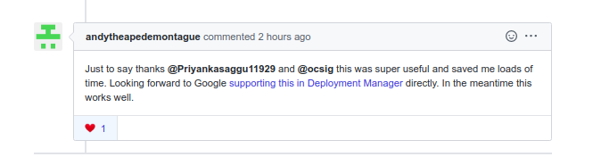

***A space for me, to free myself from the silent struggle of writing a whole blogpost, when I just want to write down a single line of thought.***

***This is my personal journal where I wish (and want) to lay down something everyday!***

*(For someone who want to read from the beginning, start [here](https://priyankasaggu11929.github.io/journal.html#may-17-2020).)*

---

## *May 28, 2021*

*self restrospective*

It doesn't matter what I write, how I write, how pretty my words are, how accurate the structure and grammer of a blog post is, or how long or short it is, how engaging the topic is, or (more significantly, this common and most frequent thought) whether this something that I want to write is worth writing or not, what people would think of me after reading this, how would they judge me based on what I wrote, etc etc and really there is absolutely no end to this trailing end of thoughts (for me, atleast)

What really matters is, that I write. Regardless of what I am thinking, what I am doing, I take time out to write about whatever it is that I am doing at the time. Ofcourse, that whatever could be ***doing nothing***, but always note that when you are doing nothing, mostly that is also you're doing something, maybe you are taking time out, maybe you are giving yourself some headspace to start again on something, maybe you are planning for how to deal with stuffs, maybe you are alreadt dealing with stuff, maybe you are feeling anxious and trying to battle with that anxiety and that's when you feel like you are not doing anything, or you are sad and you feel like you're lagging behind from everyone, here again you are doing some real hard work of getting along with that feeling and coming out of that, maybe you are jealous of everyone around you and you're deep under your own circle of inferiority complex, acknowledge that because again this is part of life. The point is, there should be no judgment on what to write. It might feel like that what you are doing is not worth writing (again it is repetitive, read the last line again), I would say writing one line, one paragraph, one page or one word or absolutely anything is still worth it. Because regardlss of what you wrote or how much you wrote, it is always rewarding, writing is something that would make you feel calm, better, no matter what.

I look at myself now. I look at various spaces on this blog, I am absolutely happy for the fact that I wrote. It is very calming, regardless of the fact that there are posts which are literally just one line or 3 words or something like that. I absolutely dont care about that currently.

I also know that I have done this (that is starting to write regularly with the hope that it will keep going on forever without failing) 1470 times before. And with no shame (ok, I felt ashamed at times, and only God knows why, because it was absolutely meant for nothing and more importantly, ended up into nothing) I have failed at this almost evey single time.

I also know that this might become the 1471th time when I would fail again at writing regularly, as in, maybe life would happen and I won't feel like writing on one day, followed by another similar day and then followed by one more and one more and so on, so, I would give up in the end. Yes, that might or could happen once again. I just wanna say, even that is fine. As far as I know I am doing it intentionally, that is fine too. I know writing is important for me in all perspectives of my life, and even after that if I don't feel like doing it at that time, it's perfectly fine, that's an intentional decision and even making that decision is a win in itself. But, on contrary if I leave it because I don't wanna try anymore even after being absolutely aware about it that how important it is, well, ok, you know you're doing it just because you are lazy and you don't want to do any hardwork, no hardwork of thinking, no hardwork of doing, no hard work of trying or the least i.e showing up and failing (which is infact the most most most important). Be ok with that also then.  ***Know that you yourslf are the one doing it to yourself.***

Now, after all this, I just wanna say to myself, you are doing good. By writing about what things you are doing, or how you are feeling, you are eventually making this very rich space for yourself to reflect upon, a very rich source of information and knowledge about you yourself, for your futureself. All this is some really awesome stuff!

Please keep doing it. It is hard but really not that hard! 🙂

---

## *May 19, 2021*

First thing, well being active on twitter for that PyCon India 2021 tickets giveaway, actually made me go back to twitter, scrolling through the endless feeds for absolutely no reason at all (& it happens all subconciously, without even me knowing at times). It's just 2 days & I can already see the difference. I'm acknowleding it & will make sure I stop doing it

Reason being, right now it won't harm me because generally I'm doing fine with my mental health. But at times, when I'm stressed about thousand things, then that twitter thing go *really* toxic I know. So, yea better now then later.

And second thing, hahahaha, I spent the last weekend mostly trying to customize this blog thing (trying making the sidebar thing to have categories & sub-categories, & also trying to create a dark & light toggle button thing). This is just a note for myself, that the blog is to write not *just* to decorate it & do nothing that is supposed to be done here (which is writing, writing, writing). 😆 

I spent a whole long day doing this. I would say it was not waste (well, because I learnt stuff) but it was *absolutely* not required. 🙂 

---

## *May 09, 2021*

***[100 blog posts milestone!](https://www.psaggu.com/daily%20logs/2021/05/08/notes.html)*** 

I'm extremely grateful to my mentor, *[Jason Braganza](https://janusworx.com)*. From the [day 1 post](https://www.psaggu.com/2018/11/06/day-1/) to today's & for all others to come, he is the one who has constanly kept me on it.

***Thank you, jasonbraganza. Thank you so much.*** 🙏 

---

## *May 08, 2021*

I look at my working desk now & I smile & I feel sooo happy, because now I have a second screen/monitor attached to my laptop.
Almost half an year back, I didn't know how to connect an external screen, or an external webcam, or what having a router with a LAN cable works like. (or what paying bills for all of them and so many other things, feels like).

There is always a first time for doing things. This time, doing the above stuff made me happy. I did them for the first almost half an year back, I am still feeling the same happiness. :)

---

## *Aug 05, 2020*

***[12:45] Productive morning!***

I'm *studying* nowadays for 3 hours in the morning & that's going well till now.

The work is finally on a nice track. No longer bothers me like before!

And the best thing, I just knocked down my second last goal weight! I'm 69.8 kgs today! :)

---

## *Aug 03, 2020*

***[22:09] Nice morning!***

The Grandma (or as I call Daadi ma) greeted me *Ram Ram* with folded hands from her terrace, when I was just trying to wake myself up for study at about 7:10 in the morning.

I saw her for the first time (I'm really not social I realised), and it was the best thing of my day! :)

---

## *July 30, 2020*

***[23:34] JOURNAL ON A HALT NOW!***

It will go on a momentary halt for now. I'm trying to bring the life back to a progressive track!

---

## *July 20, 2020 - July 21, 2020*

***[22:21] Finally, the *working days*!***

There was all work, work and more work. The day was productive, well managed & I read a lot as well!

---

## *July 18, 2020 - July 19, 2020*

***[23:27] The weekends!***

Just like my normal days this time. I didn't even cook this time.

The first day because, I kept foolishing spent the entire day, thinking absolutely about nothing productive at all, all negative bad stressful thoughts! An unneccessary *overthinking* that was!

Although, the day ended with some super solid dose!

And sunday, I didn't cook because I was not well!

But I finally finished one book entirely, **The Obstacle is the way** by *Ryan Holiday*. I'm super inspired by this book. Also, It never made this much sense to me ever before, as it happened to me today. I'll definitely keep re-reading/listening this later too in the life. The last some lessons that I recall are *Memento Mori* i.e. I'm mortal & I've to die, and the second is *Amor Fati*, which I'm quoting below.

>t is why amor fati is the Stoic mindset that you take on for making the best out of anything that happens: Treating each and every moment—no matter how challenging—as something to be embraced, not avoided. To not only be okay with it, but love it and be better for it. So that like oxygen to a fire, obstacles and adversity become fuel for your potential.

And finally, from now onwards, I will keep this daily journal to one or 2 lines only or maybe as short as possible, and better start writing regularly on the main blog now!

Good night!

---

## *July 16, 2020 - July 17, 2020*

***Missed logging!***

I've absolutely no idea what actually I did. It was just work, work and work for most part.

Thurday, I have no idea what all happened. I'm sure it's because of the unneccessary stress I carry all the time.

But the *James Claer* quotes are always the best things for any tueday, so, I'll put them here for me.

>"It is better to start as a fool and learn from your mistakes than to fake being a genius and ignore your errors."

and,

>"Be forgiving with your past self.
>
>Be strict with your present self.
>
>Be flexible with your future self."

and the best one for this time,

>"Action forces prioritization.
>
>If you're stuck deciding between options, force yourself to act. You can only act on one thing at a time, which means you will have to make something the top priority.
>
>Even if you pick wrong, you'll learn something."

Now, summarizing friday.

I worked really hard during the office hours, attended the kubernetes second node-reviewers meeting late night. And for the first time, I realised what actually I'm supposed to be doing there through that mentorship program. Happy that I got to have a separate conversation with another fellow member from the mentoship group. Talking to people is the best thing I have learnt over this recent times!

---

## *July 10, 2020 - July 15, 2020*

***[11:36] Pending Logs!***

I'm guilty. I didn't write here for like 5 days now, which is just procastination (exactly every single time)!

But I had this massive emotional rollar coaster for this time. I was super happy at one time, and other times, I cried as well!

***[July 10, 2020] Friday***

For the whole day, I waited for the parcel (papa's phone) to come & it got delayed!

I worked through the office hours, and in the night read some 40% of this book **Finish What You Start** by *Peter Hollins*. Everything written is totally worth!

Late evening, I attended the kickstart meeting for *kubernetes SIG-Node Mentoship program*! 

***[July 11, 2020] Saturday***

Weekend day 1! 

I cooked breakfast for everyone. Daddy loved it, and mommy too. And I think I cooked lunch as well. Over time, I have realised, cooking is a real stress reliever! :D

Finally, late afternoon, the phone arrived. Daddy was happy, really happy. And me? I was the happiest! :)

The rest of the day, we spent sitting around the phone (I mean setting it up, transferring data and stuff XD). I just watched actually, bhai did all that.

So, yes, this day will always be one of the most memorable days of my life. I gifted my father something really expensive, all out of my own. I can see, he is proud. Not because, I gifted him something, but more because I care for the family. And I really do! :)

***[July 12, 2020] Sunday***

More cooking. I absolutely love it!

Ah, sunday I think I mostly spent sleeping. And later in the evening, sister came back home, so I cooked some food for her. :)

Hahahaha, yes, the weekends for me, are full of cooking only!

***[July 13, 2020] Monday***

There were guests at home. So, helped mommy with preparing lunch for them!

And there was office too, so worked there too!

I was really anxious for many things. So, meditated as well. Overall, it was another normal regular working for me, with the extra of guests. The good part is, now that I have lost weight, I go and meet people, sit with them & talk as well. Earlier, it was me *literally* hiding for the whole time, whenever somebody came to home, with the fear that someone will poke me for my fat/obese body & endlessly advise me to diet, exercise & what not!

I'm not sure it was sunday or monday, but on one among the two days, I read another chapter of **The Biggest Bluff** by *Maria Konnikova*. And other day, I read two more interviews with *Dr. Vijay Bhatkar (world renowned for the Indian super computer, Param)* and *Sanjeev Bikhchandani (founder of Naukri.com, 99acers.com & jeevansathi.com)* from **Moneylife - Pathbreakers**, Part 1. I was highly inspired because both of them were real example of starting from the ground to reaching the heights! 

***[July 14, 2020] Tuesday***

Another working day!

I worked all throughout the day. Just working, solving some pending issues. And I had good progress around them. So, until late night, everything was perfect for a working day, until I received some feedbacks.

I'm just ok with everything right now, because the goals are different. Right I just want to learn & explore as much as I can!

***[July 15, 2020] Wednesday***

I'm really very happy. Although, I cried in the morning. Ok, today it was tension & stress, not the happy emotional me. XD

So, the reason for happiness?

I finished writing my logs here, in my morning pages, on my fitness page, on the meditation page, basically everywhere. It genuinely bothers me when I miss because, I'm trying to log these for my-own-self, to make sure I have my own record of good & bad times, and to make myself aware that not every time is same!

Now, the goal is to reduce the size of the logs (which was the actual plan, i.e. writing small logs), so that, it doesn't look like a work to me!

Ok, now I'm off to work!

---

## *July 09, 2020*

***[23:12] Early start, today!***

I woke up around 6:20ish in the morning, went to terrace, sat there enjoying some old hindi songs & sipping warm water. And then after so many days (or weeks), I finally meditated for some 20-25 minutes in the morning. I was super calm, super peaceful, and super energetic for a fresh start.

After some 2 hours, I came back, cooked breakfast for mom & bhai and then mine. Then I watched cartoons for about an hour, and then did some more chopping and finally, I even slept for an hour again. XD

Today, there was office work all throughout the day, me struggling with the funny ingress & loadbalancers. Just a little success, although me & a colleague worked really hard & for long hours on this. Which actually remind of this quote from today's *James Clear's* newsletter.

>"Time spent working hard is often better spent identifying where the bottleneck is located.
>
>Working hard on the wrong thing leads to frustration, not progress."

So, ok, we spent time doing both, but I'll keep this in my head next time!

The entire day was spent really nicely, but right after I wrapped up the office work, I had this strage anxious feeling of sadness & stress. So, I literally meditated three times today. XD

It worked actually. I'm feeling much much right now. :)

*James Clear's* newsletter as he says in his words, *certainly* deliver the most wisdom per word!

>"3 things that help habits stick:
>
>1) Repetition. Habits form based on frequency, not time.
>
>2) Stable context. If the context is always changing, so is the behavior. You need a reliable environment.
>
>3) Positive emotions. If it feels good, you’ll want to repeat it."

and this another beautiful quote

>"When you lose track of time, you are either living your best life or wasting it."

And finally the question, **What am I avoiding just because the desired outcome would take longer than I'd like?**

*I'm sure there are a lot of things that I'm avoiding. Just that at this very moment, I'm not sure what exactly they are! But yes, there are lots!*

Ok, calling it off for the day now.

But before, I leave, I know "the impatience/sudden urge or sudden desire to know things right at the moment and then stress about it no end", *is* the biggest issue most of the times, in my life. I'm writing about it now because I just read this one toot by *[jasonbraganza's](mjbraganza.com)* [here](https://toots.dgplug.org/web/statuses/104484491014993493) and this is what I should do at these times!

That's all for the day. Good night!

PS: After 3 weeks of plateau, today I weigh the lowest, i.e. 72.6 kgs. :D

---

## *July 08, 2020*

***[23:10] A happy, productive day...***

A long working day!

I'm really happy for my brain is back to the work mode. I can nicely focus on my work now. :D

Today, I'm almost done with my Rancher HA setup. The only thing left is to check the firewall (security groups) that is restricting the load balancer DNS to hit the target groups. So, yea, some minor changes left, and it will be done. Apart from that, I picked up some more adhoc tasks around Product setup, and those are finished!

Evening, I had another nice conversation with *Jaime Melis*. It was thoroughly insightful, I learnt couple more new things in nice detail. :)

That's all about the day. Work and meeting, and more work, and more tinkering, and some tangible results too.

A happy peaceful day in the end!

Wrapped up the work now. Also, surprisingly, someone asked me for a resume review today. Hahahahaha, it's my time now, to pull all my learnings (from my own resume reviews) to the front, and help back to my level best. :)

Ok, that's all for the day.

Some of my friends are struggling really hard on the job search and things. It's turning really bad for everyone now.

I'm praying for this situation to get better. Honestly, now God only can do some magic!

Ok, finally done now. Good night!

---

## *July 07, 2020*

***[23:20] Another working day...***

Morning, I started with lots of learning around AWS networking concepts. I'm happy that I spent good time around that. Also, that's something a part of the current tasks at work.

After learning the above for quite a good while, I started with work!

And very soon I realised, that yesterday's managed kubernetes issue I had while importing clusters inside Rancher, was a simple IP whitelisting issue in the security group. I felt funny for once because it was a very simple thing, but I'm happy I learnt a couple more approaches too. Those were not right, but still very insightful!

Later in the evening, I had some conversation with a panel of some really nice folks. I learnt more about SRE and Ops concepts there. It was absolutely nice talking to all of them!

I loved the discussion I had with *Aditya Konarde*. I was even more happier talking to him in Hindi, during a technical conversation. And cherry on the cake, was that we had a good bunch of people in the mutual network, that made the conversation even more pleasent!

So, overall, today was a nice peaceful, exciting day!

I'm really grateful to God for blessing me with some really generous people in the life!

Calling it off for the day now. Good night!

PS: The meditation part is totally ruined. I'm not happy, it's just the laziness. I need to do something about it now (hell, basically I've to do it!).

---

## *July 06, 2020*

***[00:39] Monday, back to work...***

A new working week!

Started in time, have this long weekly team progress as first thing in the morning (before that I quickly deployed some rancher servers).

Then I had a demo session around Sentry (centralised cluster event management tool) integration with Pagerduty (an on-call, service esclations, alert/notification endpoint).

Then, I finished the ASG in EC2 High Availability setup for Rancher. Will enhance it more tomorrow with an external mysql server for state management (right now, a new redundant configuration is created in every newly spinned up instance).

The next blocker is to decide, whether it is right to do a workaround for exposing `cluster.yaml` file of a managed EKS cluster to Rancher or not. It's basically exposing the part which is intentionally secured by AWS. So, need a discussion tomorrow around it!

Late evening, I ordered a phone for papa. This is actually my first (really) expensive buy for him. I am happy & little emotional. :)

And last thing for the day, was this amazing information sharing session with *Nuritzi Sanchez*. She is an incredibly kind, really humble, absolutely amazing woman who so nicely gave me, a huge helpful & most insightful set of advices.

I've wrapped up the work now. Happy that I've written the pending journals too. It's something that I want to keep at!

Calling it off for the day, Good night! o/

PS: I learnt about ACM (Amazon certificate manager), although I imported my own set of certificates. XD
---

## *July 05, 2020*

***[Late post] Sunday...***

I don't remember much (because I didn't do anything interesting).

I slept for a good long time, that was good. :D

I ate a little more than usual. Not anything junk or something that I can't eat, but consumed more calories basically (some 1400), and that made me a little irritated/frustrated. :')

That was the sunday mostly. I really don't remember more now!

---

## *July 04, 2020*

***[Late post] A nice saturday, it was...***

The plan was to work on office tasks, but the saturdays just doesn't feel like a working day to me. More because Papa comes back home from work during the weekend, and so everyone sits together and talk or eat. So, I also feel like sitting with them, rather than working. And that's what I *actually* did as soon as I was up!

Then I slept again for a good time during the day. :)

And I talked to a friend. I absolutely love spending my time talking to people, whenever I get a chance!

Later afternoon, I received the *MoneyLife - PathBreakers* Combo set. So, I spent time reading two of the interviews from Part 1 (first with Mukesh Ambani & second one with Rahul Bajaj).

Other times, I watched korean/japanese food videos. Now, the idea is to watch videos of non-vegetarian food stuffs. I'm a vegetarian, so I don't crave for anything of it, it doesn't make a wee-bit difference to my taste buds, but I still love watching all of it! XD

Yup, so that was mostly how I spent the saturday! :)

---

## *July 03, 2020*

***[23:17] A long working day...***

Another week ends today, and it is ending on a good productive note!

Today was quite a long working day, and I learnt a hell lot of new things too.

I manage to learn how to create the following resources in AWS Cloud Platform.
- Launch Configuration (with both custom AMIs & regular AMI options)
- Target Groups
- Auto-scaling Groups (ASG)
- Application load-balancers
- Internet Gateways (IGW)
- Connect IGW to VPC & finally, add them to Route-tables
- Spin up EC2 instances through ASG & add a loadbalancer in front of it.
- Distribute incoming traffic to load-balancer on different target group via setting `path` based rules.

So, yes, certainly there was a lot of learning today, about AWS Cloud Platform, but I was still not able to achieve the intended results. So, I'm working on saturday as well, this time!

By the way, I'm trying to setup a *High-Availabilty (HA) Rancher* setup.

In the evening, I attended *[kushal's](kushaldas.in)* live-coding session around *extending the DNS tool* written by him in Golang. I joined sometime in the middle, so from where I picked up, I got to learn a lot about what different *DNS Record* types are (I knew a little about them, but was not much aware. So, it was certainly a thourough deep learning today!). Besides, I also got a bit understanding around what different columns comes there (in case of different *DNS Record types*), in the **ANSWER SECTION** of output of `dig` (DNS Lookup Utility) command.

That's pretty much all the technical learning from today!

And ok, I missed writing about the morning!

So, in the morning, I continued reading the book **The Biggest Bluff: How I Learned to Pay Attention, Master Myself, and Win**, by *Maria Konnikova*. I'm four chapter down now. And I think it will take me *some time* to finish it!

<strike>Below are some excerpts I want to put here for myself. Those are my learnings from today!</strike> Actually there were lots of them, so, I posted them as a separate post [here](https://priyankasaggu11929.github.io/writing/2020/07/04/book-notes.html).

And finally, there is a big confusion in my head (apart from thousand others). From the last 2 weeks, I meditate but I do it just before I'm about to sleep. So, basically, the meditation only makes me asleep. 

Does that count as a meditation?

---

## *July 02, 2020*

***[01:56] Productive & peaceful one...***

Finally today, I've had *all* my focus on the work. So, I really made some nice progress as well!

I started reading the book *The Biggest Bluff: How I Learned to Pay Attention, Master Myself, and Win* by *Maria Konnikova* (after *[jasonbraganza's](https://mjbraganza.com/) recommedation*). So, far I've just touched the third chapter. This is the first time I can make some sense out of a book, without re-reading the pages a hundred times. I'm already learning a lot through it!

I started listening to [this podcast](https://tim.blog/2020/06/26/hugh-jackman/) during the office hours, so, I know I have to listen to it once again, because I can't do multi-tasking. My brain just doesn't work this way. But one thing hit me hard here, which *jasonbraganza* quoted here in one of his [latest toot](https://toots.dgplug.org/web/statuses/104442859880017003).

>Everyone takes a shower every day, and we don’t complain about it.
>
>We do it out of discipline.
>There will always be an excuse not to meditate.
>
>— Hugh Jackman

Now, why it hit me hard? 

Because I'm exactly doing the same thing. I'm missing [my meditations](https://priyankasaggu11929.github.io/meditation.html) quite many times from last couple of weeks. And there's no good reason behind it (but my own excuses to procastinate).

But I really don't want to break atleast my these some good habits, so I WILL MEDITATE!

Now, I will go and watch this *Byron Woodfork's* talk, [THE TRUTH ABOUT MENTORING MINORITIES](https://www.thestrangeloop.com/2017/the-truth-about-mentoring-minorities.html). Folks from #conservancy (on freenode) suggested this while today's discussion about *Mentoring Miniorities*.

*(I'm linking it here beforehand, so I can come back here & pass it to others as well!)*

Ok, that's pretty much all from today. I'm continuously working for the better time!

Good night!

PS: It's thurday & *James Clear* today's question is ***Am I being good to myself?***

And my answer is:

*No, I'm not being good to myself atleast for last some weeks. I'm just not being nice to myself, the worst is, not even meditating when I need it the most. But now, I'll do it. It **is** the biggest priority!*

---

## *July 01, 2020*

***[23:47] It was hard!***

Today, I'm absolutely not feeling like writing anything here. But that would simply be breaking the real motivation behind this personal space.

Ok, so today, it turned out to be a real bad day for me, and also my second realisation in the row, that nothing in this life works like how I expect them or how I want them to happen. There are always good, bad or shocking surprises in the way, and that's the only time where prior hard-work, the preparations, the margin helps.

And that's exactly where I lacked today, both in the my prior work & my confidence & my preparations!

I won't lie saying that I'm not sad. I *am* really very sad right now, but I also know that this is of no use to me in anyways!

So, compiling the good things from today!

I worked really hard during the office hours. The trial PoC around Rancher On-Prem platform & K3s cluster setup went absolutely nice way. And now, I've picked up the further steps around replicating this PoC for a Production-grade HA setup.

Also, I took my next steps towards the kubernetes community contribution. I've managed to finally gather some more *good first issues* in the process of the org membership sponsership. That means I had some more progress today! :)

My only advice to myself after today is, *I certainly need to work more harder. But I also need to first calm down a bit. And make sure that I'm not awefully stressed or burnt out!*

Good night!

---

## *June 30, 2020*

***[LATE JOURNAL- I'm writing on the next day ie. July 1, 2020] It was a really good day...***

Yesterday, was a very productive day. I worked a lot. I read a lot, learnt even more & applied as well during the office hours.

But, here is the worst thing about late journals! 

I just recall this much that I read a lot of good articles/posts or something. But there is no memory for what exactly it was. And now I really can't do anything, because (foolish me) even after knowing about feed readers, I just don't maintain one. Maybe now, I shall do it! 

Although, there is something good, I still remember from yesterday!

It was *Ramit Sethi's* birthday, and he sent this very beautiful newsletter telling about the same. So, I want to quote some part of it here, where he leaves an advice for all of us!

>So this year, my advice is: LIVE TO FIGHT ANOTHER DAY.
>
>If you’re in any kind of journey — a business journey, financial journey, fitness journey, even relationship journey — do whatever it takes to make sure you’re here to push forward tomorrow.
>
>To me, this changes the way I approach things. It means I invest in relationships. I don’t cut corners. I can push hard...and I can also take breaks, knowing I have a long time to get there. And I’m conservative, knowing that I want to create backups so I never get my back against the wall.

By the way, I worked alot yesterday, so that's why it felt good & very productive to me. Emotionally, the last two days were very rough for me!

Yesterday, was the first realisation again that I've to keep learning. It's not gonna be an easy walk every single time. Expectations changes with time & work & words, so do the hard work required behind it!

And so, I tried to cheer myself this way:

---

## *June 29, 2020*

***[23:33] A good day...***

A very nice start of the day. I read some good articles, one amongst is, [The fastest way to learn](https://www.swyx.io/writing/learn-in-public/). Although, I'm already aware of most of things mentioned inside the post & even trying my best to add most of them in my routine as well, still it was a really nice read!

And I continued my learning! 

Today, I spent a lot of time understanding kubernetes, in a better way. The intent behind was that I could explain kubernetes to others as well, in the most simplest possible way. It was a missing thing before (and I realised it on  *this one fine day* last week). I mean it's been some months now, since, I've been using kubernetes, almost on a daily basis, but still I lacked the basic fundamental understanding only. But now, I think I made some really good progress. It will help me in the coming days hopefully!

Apart from kubernetes, I learnt more about linux-sysadmin part, a little about vim editor configs, some more cloud computing stuffs, on & off.

Finally, there was work during office hours. I've compiled a good long list of tasks that I can nicely cover over this week. So, There was a little progress today from office as well!

And now, I want to sleep, as my head is aching badly because of some funny p reasons, I don't know!

But there's one more thing left for the day. Let's see if I can quickly finish it somehow. Ok, rushing to writing the pending blogpost!

Good night! o/

*[1:52] PS: Finished the blogpost!*

---

## *June 28, 2020 & June 27, 2020*

***[21:02] The perfect weekend...***

I loved it!

It was *really* the perfect weekend! 

It was peaceful, I was *really* happy, I did all things that makes me happy, I learnt a little bit here & there. And I enjoyed it thoroughly!

Now, the only desire is, this world *get better soon*. Everyone get to start their life back again, safely & nicely. And we all get to do some things, that we had planned for a good long while now. :)

There's is nothing bad in taking a short time out of the work, learning and all other stuffs that require focus and efforts, I think it really helps to get back to the *life*. Top of that, if you get a chance to spend this short time with the near dear ones, nothing could be any better than that!

And *now* while the weekend is over, I'm slowly prepping my brain to get back to the regular hassle for an another week now! I really pray, this coming week be the one I have prayed for these last some days!

I'm really praying hard for *some specific things* to happen now!

Thank you God for everything! :)

---

## *June 26, 2020*

***[23:15] finally, a nice day...***

In short, I had a couple of nice long productive conversation with people. It was really nice talking to all of them, I learnt thoroughly, I'm boosted to start again, let's see if it will be more helpful or not!

So, yeah, I found my day to be a real productive!

I don't recall anything much. It was mostly talking talking & more talking. Otherwise I was working or chat!

In the evening, although, I got a chance to talk to some more folks from the channel #learnandteach (ah, that feels like a family). I love these sessions from *[kushal](https://kushaldas.in)*. And even, today was the first time, when I, actually, was able to join it in time & be there throughout & learn & in the end, actually *talk* as well. I enjoyed it. It's always worth it!

And yeah, there is a little more too, from the day!

Today, I knocked down my fourth goal weight. So, I weigh 73 now, which means I'm 22.7 kgs down from the highest weight & 15.6 kgs down from the day I came back home in march (after lockdown). I'm happy! 

And the metabolic age on scale counts to 25 today. That means, just *3 more years* to go now! 😍️ 

And tomorrow is weekend! That's the best thing!😁️

Now, I'll go & watch some random videos or something, for sometime! And meditate & sleep then!

Good night! o/

Happy Happy weekends! \o/

---

## *June 25, 2020*

***[23:58] A much better day...***

I worked on office stuff for a quite long time today. There were some tangible outcomes!

But I'm happily surprised about a couple other things!

I helped a new intern in the company, giving him an entire walkthrough around the product specifics for about a couple of hours. I sensed that he understood everything. It was satisying for me, as in a new intern finally got to understand the product at such an early stage in his internship. :)

Another guy approached me today for some help and advice around company hirings. (*That was a little funny, me advising him over that. But it's ok, I can advise everyone the best solutions, implementing them is usually hard!*).

And later, I was specifically approached to schedule a call with two girls & help & guide them for taking better decisions. I loved it. I really want to help women/girls/underrepresented-folks as much as possible & in my reach. Well, I want to help myself first although!

I made my first ever contribution (which is now a merged PR) to the kubernetes community project. Ok, it was just a mere broken link fix. But still, any start *is* a start. Now, the plan is to pick up some more *good first issue* & get the org membership as soon as possible. I need it for getting into the mentorship program. :)

Apart from all these, there is no big difference from yesterday. Although, there are some talks extended, let's see how it goes for me. I'm praying hard for myself right now!

Good night!

---

## *June 24, 2020*

***[23:19] A day full of lots of emotions...***

I'm trying hard to make my way to a better side. There are some small wins, atleast now I know I'm capable enough to start once again!

There was happiness, sadness, frustation, excitement, confusion, tension, and a lot more, all throughout the day.

And now, it's just not my own life that is giving me a little hard time, the surroundings are full of stress & tension too. 

Actually right now, life is getting much harder for some others (around me). Atleast, I can look for my way outs, all by myself. Poor these people, their entire family is suffering and splitting because of some shit money related family issues. And my parents with all others, being part of the community & society and family, are trying to be a help, atleast the emotional support.

So, it's turning *really stressful* all around me. I'm just trying my best to relax & meditate (I'll go and meditate now) so atleast my brain pains a little less. Like I can really feel the stress inside my head, it's aching badly right now!

But with God's grace, I'm still lucky to have some source of hope, even now. I'll make sure I make the best out of them.

That's all about it. I really pray things get better for everyone. People need love, care, and *a lot* of mental peace. God please bless them & me too!

Good night. Hope tomorrow be a better day!

---

## *June 23, 2020 & June 22, 2020*

***[21:37] Worked a loooooot...***

I hardly slept for 4 hours for last 2 days. Because I was trying to finish a personal side work, and also there was lots of office work too.

After so many days, I finally feel like I'm a DevOps person, like atleast I know how to get my things done somehow.

And I learnt & practiced a lot of ***go programming!*** And also I'm happy, that I can handle this one database/data-structure-store, *Redis* inside out now (to a good extend).

After so long, I wrote *Dockerfile, Docker-compose file & ansible playbooks* today. I just did what was asked. It works exactly the intended way & that's more than enough for me, for now. XD

I really wish things turn better for me now. It's hard juggling between things that I don't want to do anymore & other things leading to the solution for that.

Ah, God bless me too!

Good night, time to crash now! o/

(PS: Today was the bestest day from last 4 months now. I got unexpected surprises, and I love them! :) )

---

## *June 21, 2020*

***[21:37] I Loved it...***

Today was the best day after so long. It's fathers day, and I love & adore them no end, and I pray for their long healthy & happy lives.

My day today, I loved it thoroughly. Thanks to God, I've the best people in my life. I just can't thank God enough for blessing me with them. :)

And, I watched three (small) movies today.

- [Light Thereafter](https://www.youtube.com/watch?v=VLPWPo1-jlw)
- [Midway to Heaven](https://www.youtube.com/watch?v=hDI0geV03us&t=5s)
- [Inside Out](https://www.youtube.com/watch?v=V9OPnV4_pd0)

Each one of them were very different, but really good in their own ways. I liked all three!

This sunday was the best. I'm really happy today. I'm feeling like crying out of this happiness, just my little happy emotional feelings.

Thank you God for everything. :)

---

## *June 20, 2020*

***[23:05] Leisure...***

It's saturday, and so I literally don't feel like doing anything anyways on the weekends. And moreover my brain needs some real rest. I'm putting so much pressure on it, that it has become a pressure cooker and it will blast someday!

Ok, puns apart, life is a little tough right now. And I'm trying to calm myself down. And that *is* a very important work in itself, so, that's what I'm ought to do right now. :)

*Back to good things now...*

On weekends, Papa comes back to home (from work) & so, having my small family sit together for a small while is the happiest part of my day.

Although *being adult* is real hard. I wish there was some other option too! 😂️

*Sadly being a girl/woman is hard too. Yup, sometimes it is! 😐️*

*Ok, back to the good things once again XD*

I watched this short movie *[Hidden Moon](https://www.youtube.com/watch?v=RRBhROkLJBs)*. And I loved it. And surprisingly, it was mostly in spanish but the subtitles worked seamlessly wonder for me.

I might watch some more now. Let's see if I find any. :)

(*And I usually don't ask people for movie recommendations, because I hardly see any. It's always some random search, that makes me watch something, otherwise I'm more than happy with my chinese village cooking videos. :P*)

Oh, there is something that I think of writing everyday but it just slips my head only (*my poor little memory*). But today finally I remember writing it! 

So, I always feel like I never spent money for my own-self (other than the essentials), like no money for my hobbies or my self care and stuff. It's mostly I love doing for people I admire. But (for the first time) I was wrong. It really never clicked me only, until this week. I actually spent some 17k bucks (7.5k once + 9.5k once) on my dieting thing. Yup, that's something huge I spent just for myself & I feel really happy & satisfied about it. :)

*(I know that (👆️) makes no sense, but it's something big and new for me that I never usually do for myself, so that's worth writing here. :))*

Ok, that's mostly all of it for today. I was supposed to work today (some side work), but I put it on my bad health (& ok, a little procastination too). And not only that, but on some guests & some more maintaince work. Literally, I want my mornings just for myself with noone around. So, yeah, I had ton lots of reasons to cover up this time...😝️

Now, leaving it & hoping for tomorrow. Good night! :)

---

## *June 19, 2020*

***[23:20] Another week over. It was quick this time!***

Late morning! Not well today, but I did lots of work. :)

The office hours were quite productive. I just wrapped up now. Everyone works really hard. I can feel the stress, pain, fear & hope in the meetings. I hope for the best outcomes! :)

So, as expected, I (almost) finished writing the *local deployment Dev-Tool*. Now, it fetches *tls-certificates & tls-keys* from some location on the local machine, encode them as Base64, and pass them as secrets to the kubernetes objects (through helm chart's values.yaml). Therefore, now the final step is, just running all the scripts together on a cluster to check if everything works the intended way. That's for the coming week now. :) 

I also had couple other tasks, that I sort of did well in. Some of them have a couple of things to re-work in the coming week. But overall, I learnt a lot and I did well!

Talking to people is the best thing I'm doing right now. And people, being the most kind & generous, are offering me some huge help as well. Now, the next step here, is to use *their help* in the best possible way & do well in the following process. And That's something for this weekend now. :) 

Just read *Shawn Blanc's* newsletter and found this beautiful excerpt from the book he mentioned ***The Crossroads of Should & Must***.

>Elle writes that there are four obstacles to doing what she calls our “Must” (i.e. our most important work).
>
>Those four obstacles are: (1) Money; (2) Time; (3) Space; and (4) Vulnerability.
>
>Elle lists your workspace as one of the four obstacles that stand in the way of us doing your most important work:
>
>You need a physical space — private, safe, and just for you. When you are in this space, you are not available. I repeat, you are not available. This is your sacred space to be by and with yourself. We all need safe containers. How might you create a safe space that you can spend time in daily? How might you get creative with where it begins and ends? Find this place and make it your own.

Now, I'll go and first read [this thread here](https://twitter.com/mekkaokereke/status/1027552459873378304), showing ***some practical tips regarding Performance Review!***

And then, I'll meditate for a short while and then nothing more hopefully but off to bed.

Good night. I wish & I pray the coming week be a really nice & peaceful one for everyone!

---

## *June 18, 2020*

***[23:15] Just another day...***

Many things happened of all sorts!

People helped me, and some offered me more help, and some pointed me to the help . I'm really grateful to each one of them.

The morning didn't come well from any side. The work, the personal, everywhere there were tensions, some real big tensions. And at these times, I wish I could've some superpowers to undo all the bad in just no time. But, sadly, there's no such super power that I know so far or have ever seen. The time is the only supreme power I know which makes everything better as it passes. I'm learning it now as I'm stepping into my real *adult* phase. Life is hard mostly, we all work hard to make it better every single day. Yes, exactly that is what each one of us is doing everyday in our own ways. I'm praying hard right now. I'm praying that God really bless everyone. We so badly need blessings & prayers right now!

Things from later in the day now!

I did the officework, finished some important stuffs there, and have wrapped it up now. 

The evening at 8:00pm, I attended the first meeting by *AquaSecurity*, regarding its open source project *Starboard*. I found the product really useful & actually the first of it's own kind. It's a security audit dashboard. I hope to use it soon & learn more about it, or maybe if it makes some real sense, then contribute back to it too. But right now, I'm just gathering all the possible information I can obtain in this period of time.

I reached out to a couple of people from the kubernetes community too. I'm trying to not get much overwhelmed by the vastness of the community & searching my own comfort tribe so that I can really start somewhere. I've no issues if it takes time, because I've really a lot on my plate right now. I'm trying the best possible everywhere. Atlest that's what I feel from inside. Rest only time will tell. :)

I will go and meditate for sometime now. But I really pray tomorrow be a better day for eveyone, every single of us.

Good night :)

*(PS: The only good thing today is, I age 26 on the scale. So, now 4 more years to work on!)*

***[23:29] Ok, I'm back...***

Just read *James Clear's* thursday newsletter. So, I want to put some part of it here.

>"The Cycle of Improvement:
>
>1. Awareness - identify what you need to improve.
>
>2. Deliberate practice - focus your conscious effort on the specific area you want to improve.
>
>3. Habit - with practice, the effortful becomes automatic.
>
>4. Repeat - begin again."

and

>"The Paradox of Freedom:
>
>The way to expand your freedom is to narrow your focus.
>
>Stay focused on saving to achieve financial freedom.
>
>Stay focused on training to achieve physical freedom.
>
>Stay focused on learning to achieve intellectual freedom."

and

>Why would I think about missing a shot that I haven’t taken yet?
>
>- Micheal Jordan

and lastly the answer to the question, ***What are you preventing yourself from feeling?***

*Preventing myself from feeling sad, impatient, crying, helpless, worthless and every bad thing. But I want to add, I'm pushing myself to feeling happy, brave, worth, competent, patient, loved, strong & capable enough to do any big thing!* 

*And I'm trying to love myself more every single day!*

---

## *June 17, 2020*

***[23:04] A day well spent...***

Yesterday, I was up until 5 am in the morning finishing the pending blog. 

Yup, I finally managed to finish it (although, throughout the time, I struggled no end, for keeping myself at it. I was hell sleepy and I just wanted to leave it once again. Sadly, it happens with me every single time when I procastinate and leave things for this long). 

So, I woke up at around 9:30 in the morning, cooked breakfast for mum, bhai & me, and then finished all the morning routines. And, nowadays, I tend to read in the morning (I can't keep at one thing although, so it keeps changing every single day, but usually it's something good & insightful only).

Today, I read this article, *[Carpe Diem!](https://janusworx.com/blog/carpe-diem/)* by *[jasonbraganza](https://janusworx.com)* (Ok, I'm super obsessed with jasonbraganza's writings. It's the only blog, that I never miss a single new post from, since the time I subscribed to it.Even, I've learnt this beautiful skill of *reading and writing* just from him. He's a *great* teacher! :) ).

Following that, I read this article, *[Do not limit yourself](https://kushaldas.in/posts/do-not-limit-yourself.html)* by *[kushal](https://kushaldas.in/posts/do-not-limit-yourself.html)* (this was linked inside the above post). 

So, the morning basically started with reading words from the lives of both my mentors. And nothing could be more special & soothing read than this. :)

Hey, btw, I landed onto *jasonbraganza's "Carpe Diem!"* post while I was searching through his blog for *Amor Fati*. But the search absolutely gave me a lot more than I wanted. 

Finally, the last link from (jasonbraganza's) post, leaded to *Daily Stoic's* *[Amor Fati: The Immense Power of Learning To Love Your Fate](https://dailystoic.com/amor-fati/)* post which I later realised is a summary of *Ryan Holiday's* book, *The Obstacle is the way*. 

I feel so happy that the time I've invested in reading books (for, the last couple of weeks), is finally connecting me to so many great writers at the same time, on similar lines. What could be more satisfying for me than me learning from all of these great people at the same time. 

(Thank you *jasonbraganza*. Life seems so better now. 🙂️)

I took a little nap, sometime during the day. Then I worked nicely through the office hours, and I'm one step ahead in my task of writing that *local product-deployment dev-tool* from yesterday. I hope, by tomorrow, I get to finish it & test it as whole.

I think that was mostly all from the day. 

But yeah, one thing, I'm really very keenly looking forward to learning about *Software Licenses*, from the upcoming series of posts by *[Anwesha Das](https://anweshadas.in/)*. This one, *[Software Licenses : Legalese to English](https://anweshadas.in/software-licenses-legalese-to-english/)* is the first post from the series. Also, my first actual insightful exposure to software licenses was also through her PyCon'17 (Portland, Oregon) talk, [The trends in choosing licenses in Python ecosystem](https://www.youtube.com/watch?v=ikT2i4I2LYY).

Ok, I think I can call it off for the day now. To me, overall, it was a peaceful day. :)

Good night!

---

## *June 16, 2020*

***[23:46] Better today...***

In the morning, I was supposed to finish writing an article about *writing containers from scratch in go*, but then I got stuck in fixing the setup around that, itself. 

And then later today, I finished reading third chapter - *Control Groups* from the book ***Container Security*** by *Liz Rice*, moving onto *Container Isolation* part now. I've already got some good enough idea about this chapter as I binge-watched her talks yesterday, which mostly talked about concepts from both the last chapter (cgroups) & current chapter (namespaces) itself.

*(I'm undoubtedly a very slow reader. I took a hell lot of time to just cover till 3rd chapter from the book. So, the only good thing for me is that whatever I've read so far, I understand most of it, and it is strengthening my fundamentals by many folds.)*

I worked for a long good while on the office tasks today. Happy that I've made some really good progress there too. Currently, I'm trying to write a simple dev-tool in *bash* script, for automating deployment of the entire lite-stack of the product, in a local cluster without the help of our traditionally used tool, KOTS (Replicated), a release|license management tool. I'm almost done. :)

For now, the plan is to finish writing the article first and then sleep. Because I know I'm procastinating this time & these other so called reasons are also adding to it a pile of excuses/reasons to my-own-self. Which I don't want now, it's for my own good & I ought to do it.

So, wrapping it here itself. Good night all o/

(PS: And yes, I meditated too. :) )

***(And hurrah, today I finished 30 days of writing this journal in one continuous streak. A whole month of writing. It makes me sooo happy. :) )***

***[01:06] Just saw the email notification to [this github comment](https://github.com/GoogleCloudPlatform/deploymentmanager-samples/issues/549#issuecomment-644894536)!***

Yes, I *do my work* nicely when I really do it with all my heart.

---

## *June 15, 2020*

***[00:04] Monday gone...***

I'm having a bad headache right now.

So, very quickly, here are the updates! 

I binge-watched *Liz Rice* talks on youtube. And now I can very confidently say, I know ***what a container actually is***.

And then, I also attended one of her talk, ***The Container Security Checklist***, live at Online DevSecCon conference. This beautiful graphic (literally) covers it all. 👇️

She's absolutely a really awesome teacher. I was so inspired that I've actually left a message for her, hoping for a discussion someday. I really don't know if her time or schedule allows her for that, but I'm hoping for the best. :)

Then I came across this article, [BLCK VC Co-Founder Sydney Sykes: Community is now more important than ever](https://medium.com/marketfit-rho/blck-vc-co-founder-sydney-sykes-community-is-now-more-important-than-ever-cafc236558ec), which put some light on the miserable conditions of the hirings in these big tech companies, even more worst working conditions of *people of color* in these so called startups | ventures. The quoted shows one of the broader ideas.

>Having that emotional support is almost equally as important as having that network that can help you get those jobs and deals

Right now, I can't summarise it because it really has lots in it, but I'll say it is something that I very closely resembles in my life.

Ok, last is I want to add this visualization here (from *[Visualize Value](https://twitter.com/visualizevalue))!*

It's really hard. Right now, I've no idea how to do both of these together but I'm *trying* my best.

Good night now!

---

## *June 14, 2020*

***[22:23] Sunday gone...***

The morning started on a good note. It was all happy, me spending time with the family. I cooked all meals for breakfast and lunch. Had a very nice chat with a friend of mine, that inspired me no end.

Although early evening turned a little stressful from all around. The social media was filled with tensions, and then there were more tensions in the family of near dear ones, so mom dad were taking care of that. Even, God knows why, whatever I read today was not in anyway a good feed for the brain (which I understood now, it's important to check what kind of information goes inside the brain. It *matters a lot*). It was just not so good day.

And there was absolutely nothing wrong with me. All this bluesy feelings were mostly because of social media and then the stupid overthinking about occassional not so good incidents and blah. 

I'm super fine now & I'm much cheerful too. Spending time with family, talking to friends is the best thing in the world.

I know I have really good people in my life - mom, dad and my mentors. They are my source of positivity and that's why even in the worst times now, I know I've the best people to talk to, share and ask for guidance. God is really generous!

One thing I've learnt, I need to be a little more careful & considerate while chosing whom to ask help for. Everyone is good in their own ways, but not everyone's way of helping is actually a help to me. So, yea that's my learning. :)

Anyways, tomorrow is another day. :)  

I'm happy I meditated, I'm writing here and that's definitely is a rewarding thing for me, at the end of my day.

I'm so grateful to God for giving me this awesone opportunity to learn and be around the bestest people. I'm the luckiest when it comes to my parents and my mentors. I can't stop praying to God for their health & happiness. I love them the most.

And I just want to tell them that I'm always there in all their good and bad, and I love them and they're the most important people in my life. 🤗️

God bless everyone! :)

---

## *June 13, 2020*

***[00:06] A day...***

I woke up late today. I meditated very late like just 10 minutes back. I wrote my morning page again very very late, like sometime in the night around 9pm.

So, overall it was a late day. XD

Nothing productive, nothing happening, just another boring usual day. (And I won't say it is a normal day, because this is not the nowadays normal for me. So, it was just *a day!* XD).

Couple of catchups were scheduled for today, but (because of certain reasons) those are now rescheduled for tomorrow. And so that was one another reason why everything turned so untimely, all random today. But it's ok, it was a holiday for me. And I spent it being easy on myself.

There are 2 things that I came across today & absolutely loved or found awefully nice.

- This short movie [TYLER](https://www.youtube.com/watch?v=y3knga2u6o8) about the pride moment of a *Nine years child coming out as gay*. :)

- And now the list turns to three. Because following the above one, I absolutely love this [moving toast by an Indian dad on his gay son's wedding](https://www.youtube.com/watch?v=gmRQ5Rtf-HI). Being an Indian, listening to a father being positive on the matters, to such a level, feels something exceptionally special.

- And last and the most insightful read for the day is this article, [An Incomplete Guide to Inclusive Language for Startups and Tech](https://open.buffer.com/inclusive-language-tech/) by *Courtney Seiter*. I consider it as a must read for every person in tech. It's important to be aware about inclusive language for both sakes.

And lastly, I reached out to some people for help. I'm happy that people so nicely reply even out of their busy, hefty schedule. I hope things turn better soon. I'm doing my work & putting my efforts.

That's all for the day. Happy sunday (for tomorrow)! o/

Good night.

(PS: I got to talk to my friend for good nice time today. That makes me really happy. :) )

(PSS: Today's morning pages were all around my mother. It's personal, but I'll say my mom is the most giving person in my life, and she certainly is the best & most loving mother. ❤️ )

---

## *June 12, 2020*

***[23:23] Finally saturday tommorow \o/***

An easy, not so busy working day (*hahaha that was a fluke rhyme :P*)

I meditated in the morning, so that's early good thing done for the day. And later I read a looot. (random all, mostly tweets & stuffs linked there) :)

I was a little sad, but certainly more empowered after reading [this toot](https://toots.dgplug.org/web/statuses/104329119064552231) (I'm quoting it below).

>In order that people may be happy in their work, these three things are needed:
>
>- They must be fit for it.
>- They must not do too much of it.
>- And they must have a sense of success in it.
>
>— John Ruskin on dignified labor, 1886.

I am really pushing to make it a reality. But it's still not enough. So, now with no other option, I'll just keep pushing myself more harder.

(*And one thing I'm sure now, I don't want to settle down in the minimum, I want to achieve the best thing for me. I really want to shine over because I think I'm still not able to prove that I'm capable enough, which is not true. I AM CAPABLE OF ACHIEVEING THE BEST THING. It might take time, but I'll reach there forsure.*)

That's my positive affirmation for the day!☝️ 

And then, I came across many disturbing things (*sadly these were related to women & work culture, and which is something I'm a little more prone to being hurt nowadays*), so I wrote this tweet (and the thread have solution too) thinking that **Linkedin** would actually see this (*or maybe God knows, consider giving it a try or finding better solutions*). Eh, nobody gave a blah to it, which is just ok.🙄️ 

<blockquote class="twitter-tweet">
Sick!   I really request <a href="https://twitter.com/LinkedIn?ref_src=twsrc%5Etfw">@LinkedIn</a> to check if they could add a feature for the user, so that the user could add something like a “custom-guidelines/things-to-Consider-first“ section for the person reaching out to them.   (1/n) <a href="https://t.co/Cjt1VeYN6S">https://t.co/Cjt1VeYN6S</a>
&mdash; Priyanka Saggu (@PriyankaSaggu4) <a href="https://twitter.com/PriyankaSaggu4/status/1271295943850123265?ref_src=twsrc%5Etfw">June 12, 2020</a></blockquote> 

***F$%KING HELL (Don't trust me but this is true.)***

**I literally got a reply just right after 3 minutes (when I was writing the above para here in the blog).** 

Literally, they're taking it as a feedback! (atleast they cared to read)

 And now, I've seriously understood the power of speaking and then not just speaking out, but speaking out with solutions. It matters!

Let's see if there would be some outcomes too!

This twitter thread [here](https://twitter.com/heidistephens/status/1271024307569901568) filled my heart with all positivity. I wish things get better & someday soon we could atleast meet people normally!

(My brave & kind) Daddy brought all my things back home from Delhi PG. So, now mommy have some more groceries & tubs (*that for the first time ever I bought with my own money*). And then my clothes, they're back home too (*I tried some of them. I'm happy they are loose XD*). And the hard disk, finally I've something to backup all my stuff again & be relieved. That's something as priority for tomorrow.

I sometimes feel I should have more people in life, to call them my friends, or to talk to them as and when I want. But then very soon my heart says, you like your own alone time more! That's what you're, embrace it! ❤️  

I think that's enough talking to myself. I'll go and watch some chinese village cooking videos. I just love binge watching them!

And a piece of serious advice! 

Not everytime, We've to take help of guided meditation (or just meditation) to come out of the sick, depressing thoughts. The easiest option is to go & watch *doraemon*. 😀️ 

Cartoons are the best thing! 😍️😍️😍️

I miss my childhood time. I was some 10 yrs old when mom used to cook a single 10 Rs packet of maggi for both me & my younger brother, & we used to eat that while watching cartoons, siting right below the TV trolley.)

Mom Dad are the bestest! God bless them with health & happiness. I really love them the most. ❤️  

Now, I'm finally done. Happy happy weekends! \o/

---

## *June 11, 2020*

***[23:45] A good but bad day...***

Wrapped up the work a while back. Now, just left with writing things from the day here. Somewhere in the middle, I might come to the good-bad part too, or maybe I don't (currently have no idea).

I read a couple of randomly picked articles in the morning. To my fortune, some of them were really good or even more, just worth every single word written there. Now, I don't remember all of them (though today I mentioned about them in my morning pages :D) but the one that really stuck the brain & the heart is the one below.

***[How To Reprogram Your Subconscious Mind](https://medium.com/change-your-mind/reprogramming-your-subconscious-mind-ecaae9640aad)*** by *[George J. Ziogas](https://medium.com/@georgejziogas)*. 

I simply loved & got inspired by every single word written there in the article. It guides, in a step by step manner, on how to shape the subconcious mind, how to get rid of the old stinky thoughts, and simply how to reprogram the way we think, how we react about certain old & new things in life. It's totally worth giving a read! (*It certainly can change the way you think about everything in life*)

Here is a quote from the very beginning of the article (and actually better a very quick synopsis for this very long piece of writing),
>“Whatever we plant in our subconscious mind and nourish with repetition and emotion will one day become a reality”
>
>— Earl Nightingale

Ok, Now I think I should be very quick laying down the rest of the things here. I'm really very sleepy right now.

First things first, I wrote very loooong *morning pages* today. Now, finally & actually I have a lot to read from my own life.

I crunched down [my third goal weight](https://priyankasaggu11929.github.io/fitness.html#june-11-2020) today, so I'm down to 74.9 kgs of weight. I'm happy with the progress & the steady downward slope. :) 

As decided that once I knock down the third goal weight, I will try wearing my old clothes from 2 years back, that I got stitched then. But I had this (strong but really stupid) anticipation that they won't fit even now. Mark that I'm almost 15-17 kgs down since I last tried them (and at that time, there was no hope for me to getting into them), so obviously now there is a huge huge difference. I should've been really positive for my ownself, because they so gracefully & easily fit me now. I've made some *real* progress and I'm so proud!

Today, I had a couple of small loud conversations with family for absolutely nonsense reasons. And at these times, I feel like I need to work on my short-temperedness. Or otherwise just f^$k the meditation, because I'm making no real use of it in my life. I should be careful how to react, that's it!

It was a productive working day. Did lots of work, wrote lots of documentation. I'm happy, I'm learning & doing the work. So far, everything is good & peaceful.

I think that's all about today. I'm done with everything for the day. And that means now, I can peacefully crash into bed.

Good night all the lovely people (*as in I really think, anyone reads it. But I assume so. So, it's ok. XD*)

***[00:41] PS: This was really something that should be here for later re-reading.***

Just read *James Clear's* thursday 3-2-1 newsletter. And here are two things that I want to put here for myself (& my future self). One is a quote and other is an answer to the question.

>The two skills of modern business: Storytelling and spreadsheets.
>
>Know the numbers. Craft the narrative.

And now, my answer to the question, ***Which of my current habits serves me most? Which serves me least?***

- Current habits that serves me the most: *meditation & writing daily journals!*
- Current habits that serves me the least: *Over thinking (turning negative thinking), self-pity!*

(PS: Today, I read all my journals from the very beginning. And now, with no doubts, I can say my writing has really really improved. And this journal has turned out to be a really wonderful & really insightful place for me. I absolutely loved re-reading all of it, once again. It took me some time, but I see the consistency have finally yielded something beautiful & something memorable for me. A pat on my back :) )

---

## *June 10, 2020*

***[01:21] Another extremely long day...***

I just wrapped up the work & I'm super sleepy right now!

But writing here is a part of the routine now, so I'm obliged to mark my presence here.

The entire day was office work. Tomorrow there is a client POC scheduled for the new product stack (office stuff), so, lots & late hours of work (*this is my way to console my heart XD*).

I don't have much to write because it was work, work and work today. But I read this one twitter thread in the morning and I once again got to know that women have contributed huge to mankind, in all diverse sectors.

I'm looking for the link...

Ok, [here](https://twitter.com/a_vansi/status/1270406823158468614) it is. This thread put light on the 1970's research findings of ***Nobel Prize-winning economist, Elinor Ostrom***, on policing. As quoted:

>It can inform the reform vs. defunding debate, with some clear empirical findings.

Ah, that's it, I think!

I'm yet to do my meditation as well and so I'll go and do the night routines first. It actually feels bad & uneasy, if I break the streak. So, doing it is a peaceful requirement!

Ok, I'm off to meditation & then bed. Good night! o/

*(PS: I've to work harder now. Some of the things didn't go even close to what was planned. I need to keep looking & keep working hard!)*

---

## *June 9, 2020*

***[23:51] A long day...***

A very unexpected start of the day. Instead of me doing something worth spending time on, I was just thinking all bs. 

Yea, I spent a looot of time doing that!

And the worst is I still haven't meditated for even once (which I should have done as first thing in the morning atleast for today). Sigh!

So, apart from the office work, I absolutely didn't do anything today. Glad that what I was working on for the whole day after (the morning hours), is actually done now & finished properly. I just submitted the PR.

Surprisingly, I'm not sleepy today by this time, which is not the usual case from last couple of weeks. So, I'll better meditate for sometime now and then let's see how it goes.

That's all for the day.

*(I wish I get to [change the cross here into check mark for today](https://priyankasaggu11929.github.io/meditation.html).)*

PS: I just read this article ***[Most tech content is bullshit](https://www.aleksandra.codes/tech-content-consumer)***. I think it's awefully true and I'm also one amongst the targeted crowd. But I'm happy, as I try to understand things too.

***[01:01] Meditation done!***

And guess what, I'm super sleepy now. But I'll just take another minute to change the cross to check mark. :)

Good night everyone!

---

## *June 8, 2020*

***[22:42] Back to work...***

The morning was kind of okish. I continued with the book ***The Obstacle is the way*** by *Ryan Holiday*. Finally I've crossed the half way mark. I'm excited for the other half too, it's a huge compilation of stories, from the lives of super motivating, & inspiring people or leaders. I'm happy I'm going slow with the book. Actually that is how my brain processes all the information. It just takes its own time to digest everything. :)

I did my work during the office hours. I'm actually done with all the assigned tasks & have kind of already wrapped up all the stuffs for the day.

I also spent some time in the morning, learning the basics of ***Go Programming language.*** Yeah, that's me taking my first some steps towards getting started with contrbuting to *Kubernetes project & community*.

And I meditated too. I think I'll meditate once again before I sleep. It makes me fall asleep in no time.

Evening, I spent some time with my mum (while having dinner), watching some mythological serials on youtube. I like them. And I like sitting with my mother more. :)

I'm happy I'm taking some serious steps in order to bringing my life to a good sorted side. Let's see how long it will actually take!

I'm trying the best possible for now.

I think that's sort of covers everything from the day. It was just another usual day.

Or actually before I go, there are 2 quotes that stuck me from the book. The first one is a one-liner from *Abraham Lincoln*

>This shall too pass!

And the second one, I'm assuming, it is straight from *Ryan Holiday* himself (if not, then too it's someone from the book :)).

>We don’t get to choose what happens to us, but we always get to choose how we react to or feel about it.
>
>And so, why in the world, we would choose to feel anything but good.

That's all. Bye! o/

---

## *June 7, 2020*

***[23:02] Sunday...***

I kept it easy for me, intentionally kept myself away from the *techy* stuff because that eventually feels like I'm working on weekends. And for a while until I *actually and finally* sort out things to one side (*hopefully very soon now*), I don't want to pile up more tensions, more funny feelings in my head. I just want to be happy, sane and really be considerate to my mental health. Everything sucks, otherwise! 

So, I started my day, continuing with the book, ***The Obstacle is the way*** by *Ryan Holiday*. I really love the kind of books I've picked (after my mentor's recommendations). These books are something that are so true to life and just something that I want to read now.

I'm really grateful that I have so many good people in my life. My parents, my mentors and a few other new friends that I've made over past some months (*that actually means, I have started talking to people :)* ). And I'm even more happy that I finally have some few female friends. It's good talking to them, it is much easier actually. 

And I actually embrace every single person I've met with (and I recall) so far. Whether good or bad, they all have taught me something. I'm a better person now (much better than what I was a month or a couple of months before, or an year or a few couple past years before. I'm changed to a better side of me and that makes me happy & pushes me to keep doing the work & keep loving my ownself).

I remember when I was in 11th standard in school, my chemistry teacher (*Kapil Dhiman*) told us something. He said, *"not everyone will point out your bad to you, and if someone would do it, they won't do it all the time. So, if somebody is stopping you from doing something wrong right now, just stop there atleast for that moment, think once again over your actions and be grateful to them. Consider yourself lucky that you've such people in your life. Not everyone teaches you life, most of us have to learn it by living it. So, if someone is giving their time to you, just embrace it and use their words to improve your decisions."*

(*His actual words were: Har koi zindagi mein tumhe tumhare galat krne p thokar nhi marega, or rokega nahi. Ye mauka bar bar nhi milega. Koi maar raha hai to abhi sambhal jao ya fir jo man mein aaye kro.*)

I think I'm really lucky. I've the best mentors in my life. I just can't thank them enough. Whatever I'm today, is just because they were there at right times to lead me to the right thing. :)

While meditating in the morning, I came across this video from headspace, ***[How to Live without Regret and Guilt?](https://www.youtube.com/watch?v=woio0Fayza4)***. It was a peaceful watch and something more of a message to me!

I clicked moooore pictures today. I'm much comfortable with the manual mode now. 😃️

I really wish the coming week be a better one and more productive (in the way I want) for me. Now, I'm wrapping it up because I want to spend my alone time. :)

I wish good for everyone there. Stay blessed. 😇️

---

## *June 6, 2020*

***[21:33] Weekend Day 1...***

I did nothing. XD

Although doing nothing bothers me, because I usually plan a looot for weekends (which again is mostly side work). But It just doesn't feel like doing anything at all. And I really want to (and I'm trying hard to) be ok with it.

*(My brain need rest when I'm doing something that I've second thoughts on, all throughout the weekdays!)*

So today, I continued with my photography thing again for sometime in the morning & then in the evening. I bothered my family a lot, because I needed some subject. :P

***[21:50] I f^$king hate some specific messages on weekends.***

I'm so so sooooo thankful to God!

My laptop just survived a massive fall from the bed, because I ran to look for some issue (yes, due to the messages). This is the second time (not counting several other accidents), I'm in a big shock! 😭️😭️😭️

I'm sooo grateful to my laptop itself. I really can't afford to handle so many things at once. It could've easily ruined my weekend & soooo many of the coming days. I'm taking a 2 minutes break! 😪️

(*Ok, this was a super extremly, incredibly nice fluke that just happened to me. I'm considering myself really lucky this time. I won't grumble for sometime now.*)

I think all my thoughts are gone now. There is nothing more coming (that I might wanted to write before).

Although, I wanted to put this message here for me (*I really don't remember what was the source, but a big thanks to them.*)

Now, I'll go & just meditate for a while. That's the only thing left for the day! (and I think I so badly need it now)

***[23:57] Meditation...***

I love how I'm feeling right now. It's the best thing. I'm sleepy now. Good night! :)

(PS: Today, I got my first writing pad all entirely filled with morning pages. I'm happy I've a good small collection of my good & bad days written there.)

---

## *June 5, 2020*

***[21:08] A good day...***

Usually nowadays, I tend to read books as first thing in the morning. But today, there were some guests in the home (and because I was working till late night yesterday, and I didn't get a chance to talk to them), so I spent the morning hours sitting with them.

But that actually ended up into me learning something new & exciting today! 

I learnt *how to use (and click pictures with) a DSLR camera*. And, so, I literally spent some early 2-3 hours (in the morning), just clicking looots of pictures. After a good long try, I got a few nice ones (*I mean I consider them nice :P*) that I've posted [here as a post](https://priyankasaggu11929.github.io/photography/2020/06/05/first-time-photographs.html). 

(*I've uploaded the pictures with their actual size, so it might take some time to load the page 😉️*).

The office hours were productive today. I was able to finish all the tasks, whatever I was assigned. I'm so happy, I'm learning something new, or improving my exisitng knowledge around things, every single day. :)

There were a few moments here & there in the day, when I was a little dissapointed because I wasn't able to do things that I very keenly wanted. But anyways, past some years have *literally* taught me to be patient with things. I won't say I'm really good at being patient, but sometimes there are no choices only, and that's what I've learnt the hard way all these past years.

Ah, and today I wasn't able to meditate properly. I actually sat for meditation a couple of times, but it didn't last for long (not because I wasn't able to concentrate, but more because there was some maintainance work going on, so I needed to shift my place couple of times.). So, hardly 5 minutes continuously at each time (which is not bad again). But I might meditate again before I actually end my day. This is more to just keep the streak going on.

Right now, I'm waiting for 20-30 minutes more to check if there are some last final nitpicks required on the work, before I actually call it off for the weekend.

Ok, the wait is over. I'm done for the day now. \o/

I'll go and peacefully meditate for some time now. :)

Good night y'all, and a happy weekend!

***[22:25] Done meditating for a while...***

Meditating for even a small while, after a long working day, is in itself a huge rewarding thing. This is the *best way* to release all those funny stress & tensions.

*Ok, now, I'm finally off to sleep :)*

---

## *June 4, 2020*

***[16:08] A very peaceful day...***

I woke up early around 5:30am in the morning and read this book ***Inside the Machine*** by *Jon Stokes*, finishing till first chapter. And then I slept again around 7:15am. XD 

Then I woke up again around 8:45am, and started reading the second chapter, more precisely this part, **The Programming model & ISA** and it actually felt like I've revised all the course of my *microprocessor* subject (from the 3rd year of my graduation). I'm really enjoying learning about the computer architecture once again, but this time I'm truly impressed by the way it is explained in the book. It is made easier to the level it is possible. :) 

Although I left the second chapter, for tomorrow.

After that, I continued the *Container Security* book from the third chapter ***Control Groups*** and learnt a little about **Control Groups (or cgroups)**. But I left it early, because I was already late to start my day with work. :)

I cooked my breakfast & then finished a couple of office tasks, had some more productive chats with people and, overall, so far, it is going very good.

Now, the best part. I really love my meditation time. Today, I was late, so I did it like just 30 min back. But because it's drizlling outside and it's nice, cool & breezy, I sat near the window and meditated for a good long 25 minutes. I'm super positive & fresh now (in the middle of the day, see that's the power of meditation).

Going back to work now. Tata o/

***[23:24] Wrapping up the work now...***

A good long working day today!

I'm so happy with my recent work tasks that so far I've finished and some more that I'm still working on. I'm learning deeply about the **observability** part of DevOps, that is (in my case) learning about how to read **grafana dashboard metrics** and then optimizing the cluster resources taking into consideration the current level of utilization (of *cpu, memory, et al*). 

(*I remember during the call with [Mark](https://priyankasaggu11929.github.io/journal.html#may-21-2020), he pointed out that Observability is a key fundamental DevOps skill & is much appreciated, if you understand that. So, that is why the happiness, because I'm getting to touch this.*)

Reading metrics was really hard sometime before. I wasn't aware only how these metrics are generated & collected and what are the units & all that jargons. Now, with time & the tasks, I think it has (*I won't say crystal clear, but*) become very clear

I'm a very confused sort of sleepy right now. I'm sleepy but not sleepy. Let's see how long I'll take to actually sleep now. But I think it's good time to log off the working hours now.

*I did something else?*

Because it was breezy, nice & cool outside, I shifted my laptop & other stuff near the window & for the maximum part of the day, worked from there. I'll say it was much much much better than working from bed, but working from desk is still the best choice (*if I ignore the cool nice breeze with drizzles* 😍)

I just read this newsletter, **the only 2 ways to restore margin** from *[Shawn Blanc](https://shawnblanc.net/)*. And loved the diagram he made to easily explain the concept. Putting it down here (for me):

And because even the newsletter itself, was soooo *to the point* for me, I want to put a part of it here too.

>**Let your life have breathing room (instead of cramming in more and more stuff)**
>
>Over the decades, we have gotten ever more productive at doing work. What used to take 40 hours, now can be done in just 20 hours. And so we piled on more work to fill up those 40 hours. And then we were able to compress that into less time. And so we added more...
>
>These days it feels as if we are cramming 80 hours worth of work into a 50-hour week. Why? What’s the rush?
>
>
>Your best version of productivity is when you are focused on meaning.
>
>Productivity over the years has gone from a focus on efficiency, to a focus on intentionality, to, now, a focus on meaning.
>
>It’s not until you get to meaningful productivity that you start to see all the benefits. This is where you’re able to be efficient with your time, intentional with what you are focusing on, and then clear about what your values are.
>
>But you will never get there without margin.
>
>Without any margin, you’ll be stuck fighting for efficiency. Just trying to keep your head above water and avoiding burnout. (Sound familiar?)
>
>That’s why...
>
>Without margin, you are unable to focus on what truly matters.
>
>And this is the sad irony.

Ok, now finally, it's time to sleep. Good night o/

---

## *June 3, 2020*

***[12:33] Back to work...***

I love it when I actually *do* my morning meditation (*and the best part is, now I sit in an open place, inhaling just the fresh air. It's literally the best thing.*).

After 2 full days of rest, now I'm back to work today. Hoping the day goes well :)

***[22:24] Very productive day...***

Finally finished all my work tasks for today & I'm quite happy that I did well. So, for context, today's tasks were ***setting up HorizontalPodAutoscaling*** in the kubernetes cluster for all the micro-services & ***ensuring if cluster-autoscaling (Node autoscaling)*** works properly or not.

Also, in the morning, I finished another chapter ***Linux System Calls, Permissions & Capabilities*** from the **Container Security** book by *Liz Rice*. I'll repeat, this book is really awesome. I'm learning a lot about *container & linux system security* related things that once was damn hard for me to even understand a bit.

Later in the evening, I got to have a conversation with some new people today. And I'm happy that people are kind & generous everywhere (although nowadays, we're seeing some major exceptions sadly).

*What else I did?*

I think nothing much. I just concentrated on my work & fortunately managed to finish it as well. :)

Waiting for a PR review, then will wrap up work for the day. I've a couple of things to look after as I actually finish work now!

(PS: Putting a link to *[jasonbraganza's](mjbraganza.com)* collection of really insightful quotes, here. So, that I can refer them whenever I want. :))

---

## *June 2, 2020*

***[13:17] A letter to me...***

*Dear Priyanka,*

*The few habits that you've built over past couple of months & weeks, please abide by them. These are some of the things that you've learned and earned after failing for a looot of time. So, don't let them go in vain. Work hard, first make sure **you're happy**, before you try to make others happy. Thrive for your dreams, and keep working in their direction. And actually, go and learn one more thing too.*

*Learn, how to enjoy the life to the fullest.*

*Now, Dear future Priyanka,*

*Meditation is the best thing that the **current you** have started doing. This is the only thing that will keep you sane even in the worst. So, for your own good sake, don't leave this habit at least.*

***[23:14] Winding up the day...***

I was supposed to do a lot of things today. Sadly, couldn't do anything at all.

So, I rested for a while. And then rested for another good while I guess, that's all I did.

And later in the day, the only good thing I did was started reading the book ***Container Security*** by *Liz Rice*. I procastinated for a long time thinking that it is not meant for someone who have just started with containerised system, but realised she has very kindly framed the content that I'm so nicely covered in the intended audience now. There is everything, absolutely everything that I had issues understanding so far. I feel like this is the exact content I wanted from so long. I'll try to finish it slowly.

*good night now* :)

---

## *June 1, 2020*

***[08:16] A good start...***

Talked to some loved ones as first thing in the morning & then meditated in the fresh & cool breeze. I don't think there could be any better start of the day. :)

Now, that I'm writing these journals on a daily basis for a while (not really big while, so far 14 days), I feel like the machine where I type these, also matters now. It's easier to write something from my own laptop than from the work laptop. The work laptop just doesn't feel like mine (and that actually isn't mine XD).

Yea, those were some random thoughts that I thought I should put here. It will keep reminding me that how good it is when I meditate & start my day nicely, rather grumpily with all that ill thoughts. And how much cool & fresh air adds to the meditation experience.

***[23:47] No work today...***

I wasn't feeling well, so took a leave today.

Although there was no actual work, but I think I did a lot of other constructive work today. Hope, I will soon get some nice results around that.

I wish tomorrow be a better day for me. I will try to work properly. :)

PS: I did started listening to ***Deep Work*** by *Cal Newport*. Was able to just finish the first quarter of the first chapter!

---

## *May 31, 2020*

***[21:51] Sunday spent well...***

Today was a sort of a free but still entirely occupied day. So, I did a lot of stuff, but those were many small things actually.

*People* say a resume should be a single page thing, so I really killed (ok, I spent) the time actually making my 3 page resume into one (*I really don't know why, but I did that*).

Hey, btw, it was not hard at all this time. I happened to finish this within an hour & 95% of everything from the last resume is still there. Bingo, I did a good work. Have a look, it's *[here](https://github.com/Priyankasaggu11929/priyankasaggu11929.github.io/raw/master/assets/priyankasaggu_resume.pdf)*.

In the morning although, I talked to a friend (who is about to be a CA) and learnt the basic jargons around money savings & investments. Actually, I'm reading this book ***YOU CAN BE RICH TOO*** by *PV Subramanyam*. It's a really awesome book for someone who's looking to getting started with understanding money investments, but my brain needed some more help to digest the mathematics behind, so that's why the help. :)

The evening was nicely spent learning about ***basics of nutritions*** by *[jasonbraganza](https://mjbraganza.com)* in #learnandteach.

Although late evening, I was a little bit disturbed for absolutely no reason at all. But I was! (actually, still I'm, but trying hard to get rid of it, because definitely there is absolutely nothing about it). I think it's ok to feel like this sometimes. It's a part of life.

Listening to [this song](https://www.youtube.com/watch?v=MDXFi3avqo0) on loop from last night. It will stay for some more time now. :)

I think I'm sad because sunday is getting over. XD

Ok, who knows what's the reason. I will go and meditate now & maybe do something more. o/

***[22:30] Finished meditating...***

It feels sooo much better now. Also, I switched to headspace today, for a change. I thing a change was much required here. :)

---

## *May 30, 2020*

***[14:01] Saturday, yipeeee...***

A part of my brain wants to work, learn & do cool things, & then another part of brain just wants to rest, probably sleep.

A big hustle is going on in the head XD.

(*will come back later to write, what happened in the end.*)

Btw, I didn't do my meditation yesterday, and so, sadly I have my first cross [here](https://priyankasaggu11929.github.io/meditation.html). But but, I corrected all the typos from the book notes, realised there were more than what I expected. XD

brb!

***[21:39] Cool, It was a reaaallly nice day.***

(Update) I didn't sleep, rather I wrote another quick book notes (I didn't read the book, it was another summarised audio book) for the book **Tribe Of Mentors** by *Tim Ferris*.

Very excitedly, I made this new page for just posting *book-notes*. Let's see how far it goes. Today's notes are [here](https://priyankasaggu11929.github.io/notes.html#may-30-2020).

And now the best part of the day!

I had a very long, absolutely amazing, informative, helpful & empowering catch-up with ***[Nikhita Raghunath](https://www.nikhita.dev/)*** (I'm unable to find out a single word to conclude it, so what all came into my head, I just wrote all of them here :D). Honestly, I went to her, asking for help (with a huge set of all sorts of common problems), but I think I managed to gather *a looooot* more from her. 

She is an absolutely amazing person (both as a listener & in the work she does). It was a first time conversation but we definitely talked *a lot*. Besides, getting a really good set of solutions from her, I now see her as an another really good person to look after, and on top of that, as an absolutely amazing friend.

*Thank you Nikhita for your time & words. You made my day! :)*

*And thank you Mridu, for leading me to her. :)*

Do I have something more now?

I think I'll watch some videos or just read some random articles, might scroll a bit through twitter (for no reason at all XD).

Before that, yes, I will meditate. I'll definitely meditate or I'll just put [this page](https://priyankasaggu11929.github.io/meditation.html) down otherwise.

*(for just me) so damn careless of you. It's absolutely of no good to you, but you're losing only if you're skipping meditation. GO AND DO IT RIGHT NOW. Yes, if you think you have to empower your own self-esteem (as you so nicely wrote in your book notes), go prove it.*

Ok, with that, I'll run now & do my things. o/

***[23:47] Came back...***

I just kept my self-esteem intact. Yes, I finally meditated today for 25 min (*where for most part I was distracted with thousand other thoughts, but it's ok, I did my part. It will become better with time*).

Now, it's finally a call off for today's journal

Good night! o/

---

## *May 29, 2020*

***[20:35] Finally last working day for the week...***

Today is one of the days for what, this separate journal was made, for. I want to write but there is nothing much to write about today.

So, I'm happy I got this one fine day to actually say, I justified the reason behind keeping it separate XD.

Ok, puns apart.

Also, the other good reason (like actually a reason) is that I don't have to think about titles here. So, it easens up the process.

***About the day!***

I worked, submitted my findings, learnings & implementations, & have kind of wrapped up the work now. Although the pace is very slow, but I'm happy with my learnings. So far, everything I learn is good for me. I just try hard to keep the learning going on.

In the morning, I finished this book **Getting Past No! (Negotiation in Difficut Situations)** by *William Ury*. It took me more than 3 hours to finish it, not because the book was long but because I was very very slow with my note taking. But the result is worth to be happy about now. If time allows, I would love to do more of these.

And I posted the hand-written (digital) notes in a blog post [here](https://priyankasaggu11929.github.io/writing/2020/05/29/Book-Notes.html). It looks like a small blog post, but mark that, it has the whole worth of teachings in it. Read if you want to learn about negotiations.

I saw there are some typos in the notes, but it's ok. 

It's really ok, like now I don't have the power to go and edit it and transfer them to my laptop & re-upload them. Maybe if it will bother me a lot, I might do it later someday (which is less probable though. I'll do it today or won't do it at all XD)

I did something else?

Yes, I missed my meditation, but I'll make sure I'll do it now. (Whatever be the case I'll update in the [track](https://priyankasaggu11929.github.io/meditation.html)).

I attended [kushal's](kushaldas.in) live-coding session in the evening. I got to hear other folks. It's always nice to hear them (*I mean I really just heard them. I was juggling between the work meetings so couldn't get a chance to talk only*). It feels like just another family. :)

I also attended a ***Hardware focused talk, basically a handson for programming different micro-controller boards using CircuitPython***. I really wish If somehow I could get the Raspberry Pi board back again here. I really want to learn doing some cool things with that. Now, that I have the resources, I don't have the board only. Sigh!

I think, there is nothing more left now. I might call it off for the day!

Happy weekend (to whosever who reads it on the same day. I really doubt although XD).

---

## *May 28, 2020*

***[01:15] A happy, peaceful day...***

There is a lot to write today. I'll slowly write down everything. And by the way, there is *a lot* because I read a lot today & worked a lot too & there are other special things to lay down too. 

***Let's start with what is special about today!***

Finally after juggling between almost near to 50 (all sorts of different technical) interviews, or getting rejected from or intentionally leaving a lot of job offers/opportunities, and then even leaving a really nice (as per my definitions) high-paying full-time job over an internship (with no surity of coversion but just with the hope to learn first), today

***I have finally joined a company, as a full-time employee. And that too on a work profile, that I actually want to learn & pursure in long-term.***

I'm happy & proud of myself that I somehow managed to take really courageous, wise & right career decisions at those high deciding moments (that too multiple times). I still remember, leaving a job was never a small or easy thing for me. But somehow I didn't regret my decisions (at all, even I'm much happier that I chose to do the right thing) and with lots of help (from many sides), I just kept doing the work. 

I'm feeling **extremely blessed to have really awesome mentors**. I just can't thank them enough, in my words. My whole life has changed into a better one, just because they were there at the right times in my life, to show me the right things. God bless them all with all the happiness, health & all the good things they wish for!

- ***Fri, Feb 1, 2019, 10:57 AM***: When I got my first ever job offer letter for Infosys.
- ***Fri, Jun 21, 2019, 12:08 PM***: Then the second one at Cognizant.
- ***Fri, Jun 28, 2019, 8:57 PM***: Then the third one at TCS.
- ***Fri, Aug 9, 2019, 2:31 PM***: Then fourth one at Yoozoo GAMES.
- ***Tue, Nov 26, 2019, 9:29 PM***: The day I got into Outreachy internship.
- ***Wed, Jan 15, 2:57 PM***: The internship offer from Atlan.
- ***Fri, Jan 24, 6:59 PM***: Then the offer at scroll.in.
- ***Tue, Apr 28, 11:29 PM***: And finally the job offer at Atlan as full-time.

*(You saw this funny thing, that all the job offers that I never joined, I had recieved their confirmations on fridays. So, maybe there is something with friday. Nothing, I was just trying to be little spooky. Ok, ignore, that was *just* a pun! XD)*

The first job offer literally made me cry. I worked so hard & waited so damn long for that first job offer. And to me, all these job offers were equally special & made me equally happy at their own times.

There were some more job offers, that I never got the offer letters for, because I somehow rejected the offers myself. And I'm happy that there are some really good names in that list (don't doubt, I had other better offers, opportunities or better priorities at the time, so I left). But at last, I'm finally doing what I wanted. :)

***Ok, now a brief about work!***

Nothing really special (even though it was my first day as full-time. It would've been special although if I was in office. Or, maybe... I'm *just* trying to console my heart XD). I worked, took some new tasks, learnt a lot around them, and did well as whole. It was a good peaceful, productive working day.

There is something really nice to mention here. 

Today, I was late at starting with the work, so, I skipped the meditation in the morning & thought I'll do it later during the day. But very soon, as I actually started with the work, I realised I was totally restless & out of my focus. I required that meditation, so I literally left all the work aside for 30 min, meditated, came back & saw the results. I was able to work properly right after that. Now, I know, meditation helps and why I should keep at it!

***And now, let's move to what all I read/watched. There is a lot today.***

- [Why people believe they can’t draw - and how to prove they can | Graham Shaw | TEDxHull](https://www.youtube.com/watch?v=7TXEZ4tP06c)
- [How to draw to remember more | Graham Shaw | TEDxVienna](https://www.youtube.com/watch?v=gj3ZnKlHqxI)

The above two talks by *Graham Shaw* are among the old ones that I re-watched today. The first time I watched them, I wasn't sure if I would ever need them for motivating myself. But yes, now, I needed them the most.

Yesterday, I was not able to draw anything at all, so, I decided to take some help today (yes, those videos above). 

These are some things I drew following those talks. I know they are some really bad drawings, but *it's ok*. Remember, I was late in the morning. Yes, because I was struggling with these in the morning. So, I appreciate whatever I got now.

- Then I watched this ted talk, [The first 20 hours -- how to learn anything | TEDxCSU](https://www.youtube.com/watch?v=5MgBikgcWnY) by *Josh Kaufman*. And I tried doing some (artsy) note-taking here too. Althought it turned out real bad, but it sums up my learnings.

*(really bad handwriting alerts!!!)*

- Followed by it, was this [How to Negotiate (or, "The Art of Dealmaking") | Tim Ferriss](https://www.youtube.com/watch?v=z3U0FRb9yr4).

I just can't summarise this because it has really lots, but lots more to discover too. So, **IT'S A NOTE FOR MYSELF, TO WATCH IT AGAIN & AGAIN**, because it has hell lot of useful advice & books & just everything I ever needed at times of negotiations.

Although putting down the suggested book names here, so that I can pick up one later.

1. Influence the psychology of persuasion, by Robert Cialdini
2. Secrets of power negotiating, by Roger Dawson (he refers to the audio version of this)
3. Getting Past No, by William Ury
4. Getting To Yes, by William Ury
5. Selling to the affluent, by Thomas Stanley

- This is one of the favorites & goto posts on [jasonbraganza's](https://janusworx.com) blog, [On Starting Summer Training at #dgplug](https://janusworx.com/blog/on-starting-with-summer-training-at-dgplug/). I have read this thousand times, but there is this one line *"I’m like a poor man’s, still failing James Altucher."* that never made real sense to me. So, today, I actually jumped onto reading that linked, really long article on & by *James Altucher*.

[How (and Why) James Altucher Writes 3,000 Words Every Single Day](https://www.writingroutines.com/james-altucher/), this is a really nice post. I absolutely loved it. It's a narrative and in no way, I can do justice summarising it here in short. For now, the title itself speaks the core idea.

And yes, now I all how understood the point behind that line. :)

- Now, one quote from *[James Clear's](https://jamesclear.com/3-2-1/may-28-2020)* thursday newsletter.

>How to see opportunities others miss:
>
>1) Study a totally different field, then return to the original problem. Apply insights from other domains.
>
>2) Invert the problem. Try to achieve the opposite.
>
>3) Talk to hyper-creative people. Their thinking will rub off.

And the answer to this question ***"If someone could only see my actions and not hear my words, what would they say are my priorities?"*** See, I really have no idea what this question actually means. But here is what I've to say:

*Because I'm writing a lot now-a-days. Absolutely everything is written somewhere, here or the morning pages or other notes. So, even If they can't hear my words, but could see my actions, they will see my priorities are very clear.* 

1. *My priorites are to bring my life into a proper peaceful condition.* 
2. *My priorities are my physical & mental health care.*
3. *My priorities are to work hard & learn from the things I do at work.*
4. *My priorities are to save money & understand investment so that I can do all the things that I have always desired for my parents, loved ones & me.*

- And now the last thing, **How to get out of your own head** by *Ramit Sethi* (it's from his today's evening newsletter).

*(Here is a [video](https://www.youtube.com/watch?v=z9TpYHaG1sQ&feature=youtu.be&mkt_tok=eyJpIjoiWVRsbE5tSmtNMlExWVRjeCIsInQiOiIwcWswQmRVbnEwTDEzeWxJcEd0RzhlZmY5RmNZckhzbnl4U2JWNVY5MUFhSzd0Y1wvcG1uaEpEa3dLRVJjS3c2dkdIWldjVkY1bG50b3pwYlpXd2hsYUs0cTl5V1F2NFwvK0ExcWRcL1orMzdPQndMUXR3c0FhZXZmYXkzZHRMcGJEWiJ9) for the same and, I'm watching this right now)*

>I’d like to share a philosophy that’s helped change my perspective on tough challenges:
>
>Instead of focusing on reducing the bad, I like to increase the good.
>
>It’s like someone who wants to lose weight. The usual advice says “Don’t eat that, or that, or that.” (Notice how negative it is. Plus people hate to be told to stop doing something.)
>
>My approach? “Forget about what not to eat. Start by eating THIS, and THIS, and THIS.”
>
>Don’t reduce the bad. Increase the good.

Ok, that's all from today. I finally wrote all of it. \o/ 

And I'm done for the day too. (But I just realised, I missed writing the time when I started writing this, in the very beginning. So, going all the way above & writing the current time now. XD)

---

## *May 27, 2020*

***[23:16] A nice day as whole...***

Work is going good. There is more progress. I'll be taking up some new tasks tomorrow.

The morning started with this nice, hour long recorded live-stream, [The Benefits of Doodling and Sketching](https://www.youtube.com/watch?v=RZsSe9UDEy4&feature=youtu.be) by *[David Neal (ReverentGeek)](https://reverentgeek.com/)*.

After watching this, I was super pumped to draw something, atleast some rough doodles. But, very soon I realised, I've lost all that creativity skills. 

(*I loved painting, sketching, drawing, doodling as a child. Now everything seems soo hard. Sigh!*)

But I still tried, although failed miserably. So, this was the final thing for my peace of mind. XD

I'll try watching some more of these kind of videos, so that hopefully I can start that random drawing thing again. It's a really awesome way to bring back that creativity and joyfulness back.

Next, I watched this super awesome light refreshing talk, *[The Faker You Are, the More Successful You Can Be](https://www.youtube.com/watch?v=bEg5ySTUGxE&feature=youtu.be)* by *Pablo stanely*.

***(This is undoubtedly a must watch. I've already marked it as one of my favorites now.)***

There is more! :D

The day was filled with cool artsy stuffs, coming from all sides today. I'm sure, I was definitely not looking for these, but somehow it just came to me.

If you want to see some *artsy doodly* butt illustrations, this page [https://buttsss.com/](https://buttsss.com/) is entirely filled with them. And they have a [video compilation](https://www.youtube.com/watch?v=jrZD6ECwcqo) too. It's *100%* super duper hilarious. Go have a look! :P

I was just about to call the day off, now. But reliased there is a little 20 mins stuff left. Will quickly finish it & directly jump to bed then. 

Good night o/

---

## *May 26, 2020*

***[23:59] A productive day...***

Today, I worked (hard) a lot & saw some tangible results as well. I'm a few steps closer to the outcome of the tasks (something on which I've been juggling for almost a week now.)
- Meditation, paid off. I was *literally* focused for just doing the office work.
- The sleeps on the weekends, paid off. I was really energetic all throughout the day.
- And the habit of reading good, also paid off. I was determined to learn, understand & actually reach the solution.

Extremely sleepy right now!

I think today, apart from the work related stuff, I haven't watched/read much.

Today's good feed comes from *Ramit Sethi's* morning newsletter, ***1 way to be happier every day***.

*(Couldn't figure out the link, as it's an email newsletter. So, putting here some of the snippets for reference.)*

***I***

>I think we could all use a little more positivity in our lives — and giving out good compliments is a great way to do it.
>
>Not only can you make someone’s day, but it can make you feel better too.

***II***

>In fact, one of the most powerful ways you can make yourself happier is to give a compliment to another person. Not just a nice, throwaway compliment. I'm talking about a meaningful, authentic compliment.

***III***

>(Notice how crappy compliments typically start with “I” whereas good ones focus on the person receiving the compliment.)

***IV***

>But giving someone a compliment is “you focused.” It’s focused on someone else, and that’s why it’s fundamentally different. That happiness lasts for them and for you. 

***V***

*(this one reminds me of [jasonbraganza](https://mjbraganza.com). I learnt this skill just by observing him.)* 

>Once I saw how powerful this was, I actually started trying to give people more compliments. It didn’t come naturally to me, but I’ve been around a number of very successful people and I’ve observed them. And they are just so good. It seems like they are naturals at just making other people around them feel good.

***VI***

>So here are two little tricks I discovered for giving great compliments that other people love, and they will make you feel great too.
>
>- First, focus on the little things.
>- Second, tell people the kind of person that they are.

That's all for the day. I'll jump into bed now (*right as I pack up the work*).

---

## *May 25, 2020*

***[21:52] A holiday more for my brain...***

Another good day. I slept for some more good time, filling up more from my pending sleeps. I feel better & more energetic now. :)

Today, everything was more of actions followed by learnings (which means, I watched/read something, then learned things out of that & then learned something more as an action to it.)

Started the day with this recent *Ramit Sethi*'s ***[Personal finance session with school kids](https://www.youtube.com/watch?v=ZjT2_8CsGXE&feature=youtu.be)***, linked inside *Shane Parrish's Farnam Street Newsletter*.

Apart from all the learnings about money, compound interests, and investments, and this really useful (all about money related) [calculator](https://www.bankrate.com/calculators/savings/compound-savings-calculator-tool.aspx), I got a couple of key points to start applying in my day-to-day life.

- Be a **CEO**!
    - **C:** cut costs.
    - **E:** earn more.
    - **O:** optimize the spendings.
- And then the three simple, yet really powerful life rules to remember.
    - Make your own ***money rules*** (i.e. choose where to spend money without thinking at all. For eg, for buying a book!).
    - Time is your friend (Start saving early, and time will help you grow with it).
    - You decide what your ***rich life*** is (& it is very personal to an individual).

Later then, I jumped to binge read ***[jasonbraganza's](https://toots.dgplug.org/web/accounts/651)*** mastodon feeds (*oh, it certianly is a treasure of all awesome diverse stuff*). Putting down, couple of things from what all I read there.

I started with *Ryan Holiday's* ***[Can You Be Still?](https://ryanholiday.net/can-you-be-still/)***. It basically taught about our (us, we human's) problem with not being able to *"be still"*. So, with *Odysseus (the greatest hero in all of literature)* example, he basically reflect the quoted in nutshell

>Of course, Odysseus isn’t unique. He is us. He’s the human condition in a nutshell. As Blaise Pascal put it, “all of humanity’s problems stem from our inability to sit quietly in a room.” Because we cannot be happy, because we can’t just be, we waste years of our life.
>
>We go begging for trouble. We invent problems. We busy ourselves. We neglect our families. We flee, as Seneca once put it, from ourselves. Then we justify it, pride ourselves on it, point to our restlessness and call it ambition or responsibility.

And then I found this lovely quote from one of [his (jasonbraganza's) toots here](https://toots.dgplug.org/web/statuses/104193723825461247).

>“Burn your wish list. I want to see your commitment list. I want to know what you are committed to doing with your 24 hours a day to close the gap between where you are and where you want to be. What are you willing to sacrifice inside your 86,400 seconds every day to become the person you want to be?!”
>
>Burn Your Goals, Joshua Medcalf

Today, I *literally* meditated for about 25 minutes (not really meditated for 25 minutes, it's just that I did the whole practice for that long) with one of [Tara Barach's meditation stream](http://www.tarabrach.com/audio/2010-07-07-Smile-Meditation-TaraBrach.mp3), again pointed by *[jasonbraganza](https://mjbraganza.com/)* in his recent [Time Management session](https://dgplug.org/irclogs/2020/Logs-2020-05-03-09-30.txt) on #learnandteach.

Also, now, I've decided to log my daily meditation as well, [here](https://priyankasaggu11929.github.io/meditation.html). I really wish it goes well.

Last, I bought & started reading this book ***You Can Be Rich Too*** by *PV Subramanian and M Pattabiraman*.

I thouroughly enjoyed my day! :)

PS: I'm regularly writing my morning pages.

---

## *May 24, 2020*

***[19:58] A relaxing holiday for my brain...***

Today, I did absolutely no work (afterall it *is* sunday & my brain needs break to start with all the weekly hassle again). I so badly waited for this weekend this time. And damn, finally I got it today. \o/

I finished my pending sleep today (truly that makes me sooooo happy for me).

Ok, there is a lot what I read, watched & listened to, from today.

***[The NoFap Legend Sarvesh Shashi | The Ranveer Show 27 | BeerBiceps](https://www.youtube.com/watch?v=x0NTMSFBmv0)***

Although this had nothing to do with me directly (apart from the meditation part which I *should* start), the last 10 minutes gave me some really good points to think over.

*(The male folks might find it interesting.)*

- Be true & authentic to youself. It'll make *living the life* much easier.
- Do self-care (both mentally & physically).
- And the last (& the one I liked the most), be *people's person* (i.e. be someone who is liked, loved, admired & looked after by everyone around).

And also, this one beautiful quote

>Love like there is no tomorrow. And if tomorrow comes, love again!

***[Fear Setting: The Most Important Exercise I Still Do Today | Tim Ferriss](https://www.youtube.com/watch?v=o7EVMjgsSME)***

Here *Tim Ferriss* talks about the most important exercise (as he says & I too found) i.e. **writing down costs of inaction** to easen up a dilemmatic situation.

For example, suppose I've issues with my job & I'm thinking of leaving the job right today.

So, I would right about the costs (or results/outputs) of the possible inactions. First, what will be costs if I leave the job right today, second, what if I stay in the job & leave it after 6 months, etc.

(Quoting a comment from the video)

>Writing down the costs of inaction is genius! It forces your mind to look at things from a different perspective. This is a great thing to do if you are stuck or don't know how to solve a challenge.

***[Should You Specialize or Be a Generalist? | Tim Ferriss](https://www.youtube.com/watch?v=wCPbPMRNnvk)***

(Again, quoting a comment from the video. It basically is the synopsis.)

>Long story short: being a specialist makes sense only if you're extremely good at what you do. If you're not, it's better to be a "**specialized generalist**", which means that you should combine several valuable skills, but not too many. The more rare the combination, the more successful you can be. Tim suggests three easy add-ons to whatever you do: public speaking, writing, and negotiating.
>Another tip from Tim: win, even if you lose. Use the skills you learned and the relationships you built during the launch of a relatively "failed" product to be more productive in the future. Projects come and go, but skills and relationships with good people stay with you.

Oh, and this one is a very good example of the same practice in action.

>I had so many interests growing up and I couldn't decide which one to pursue: psychology, electronic music, photography, computer science... so, I decided to pursue all of them. I did my degree in psychology and my masters in research methods, worked as a photographer on the side and made music and websites for fun. I ended up working as a Data Engineer for an audio focused machine learning company, capitalising on 3/4 of my interests. It doesn't even feel like a job.

***[How To Tie A Perfect Tie... Every Time.](https://www.youtube.com/watch?v=-3IDkvsZ6I0)***

Putting it here, because I went through a nostalgia after watching this. 

My father is the one who taught, ***how to tie a perfect tie-knot*** to all the men on the paternal side of my family (as I heard from the stories). I also learnt it from him when finally I got my first ever actual (school) tie, after the ready-made one (the one I had as a kid which basically has two strings to tie around neck).

***[My Top Travel Tips | Tim Ferriss](https://www.youtube.com/watch?v=dY1OYkOJ0XI&t=2s)***

I have so much in my bucket list now. I wish I could travel the same way (or better) someday in my life. Dreams I want to live! :)

***[How to Network | Tim Ferriss](https://www.youtube.com/watch?v=kMcgWK6LYyc)***

A really insightful video, describing how *Tim Ferriss* did his networking before the launch of his first ever book. He talks about how he approached meetup moderators (mostly neglected & underrated folks) rather than the intended folks directly, for *eliminating the direct asking part* & eventually earning the *first introduction* through a mutual person. And more, it's something to watch again over time.

And finally the last thing, I started this audiobook ***The Obstacle Is The Way*** by *Ryan Holiday*. 

I'll definitely write book notes for this one. Maybe in parts because it has so many amazing instances from great personalities.

---

## *May 23, 2020*

***[16:13] A peaceful day...***

It was a nice early start of the day.

I read book notes of **Permanent Record** by *Edward Snowden*, from [here](https://www.ravinderdeol.com/notes/permanent-record-edward-snowden) & then [here](https://goodbooksummary.com/permanent-record-by-edward-snowden-book-summary/). 

Continued Chapter 3, "How you run Python" of **Learning Python** *by Mark Lutz*. It's a fairly long chapter. I'll take time to finish, might skip a couple of parts too which I'm fairly aware of now.

Followed by this lovely article, [No You’re Not Bragging And Other Tips for Creating Your Resume](https://levelup.gitconnected.com/no-youre-not-bragging-and-other-tips-for-creating-your-resume-23809d8c8d30) by *Dasani Madipalli*. I felt most connected with these words from her (it's exactly something [what I wrote about myself 3 days back](https://priyankasaggu11929.github.io/journal.html#may-20-2020)), 

>Writing personal essays and talking about myself was definitely not my forte (though I guess that is what I am doing right now haha)

And I think this article is going to be my goto recommendation for anyone who is struggling to write their first resume.

Today, I finally finished and posted a 5 months old, pending post about my [Outreachy experience](https://priyankasaggu11929.github.io/outreachy/2020/05/23/Experience-applying-to-Outreachy.html). Which means, now, I have my own set of documented answers to the FAQs, folks usually have before applying to Outreachy Program.

Later, I also watched this FOSDEM'19 talk, [Designing Command-Line Tools People Love](https://www.youtube.com/watch?v=l89Z0RYseFs) by *Carolyn Van Slyck*. It was a nice introductory session about how *to build command-line tools that are not only easy to learn, but something that other developers are willing to maintain.*

And then finally, I had a quick crash session (from work) around the entire kubernetes cluster architecture.

---

## *May 22, 2020*

***[15:21] Finally writing the first half here...***

I woke up early, first at 6, then at 8, did something (maybe scrolled through twitter, or through youtube), started listening to this podcast from [Tim Ferris with Kevin Hart](https://tim.blog/2020/05/20/kevin-hart/), but slept back again in midway and finally then woke up at 10:10 am.

As usual (or actually my 3 days old usual), I started reading chapter 3, "*How you run programs*" from **Learning Python** by Mark Lutz. Finished some 10 pages (5 leaves) and left. Wrote my morning pages (today they actually became late morning pages, but anyways I kept the streak).

Finally after so long, got to talk to my mentor a bit (and that ultimately became my good feed (and the best thing) for the day). :)

Started working late today, around 1:45 pm. I had to prepare, cook & then eat, apart from the time to all the good habits I am trying to build now-a-days.

Mom's got injured yesterday. And so, when I had to do a couple more things with my new usuals, I realised it's hard, it's *real* hard to handle everything at once (although my *everything* was nothing of a big deal, but just to cook some food and that's all). Also, it's not that I don't cook, I actually cook every single day but then at these times mom is well, and so everything looks super cool.

So far, it's going good. :)

***[21:29] Wrapping up early today...***

No good progress today. More research & some more learning. I think this weekend is not gonna be an actual weekend. There is a lot of work. And on top of that, I have a lot to learn first. Sometimes, I feel I don't know anything only, so, how the heck I will ever be a good addition to the team. Everything seems so overwhelmingly complex to me. 

But I still believe everything demands it's proper time & lots of patience & practice, to actually start making some sense. And I'm in the process!

Sometimes it's really important to understand that not everything is *easy*, and not everything can be learnt & applied in the same way as other things. And in these cases, it requires *time*, it requires *focus* & it requires some *deep work* to actually achieve them.

I'm getting more serious about my learnings now. I really need to work hard. I've to keep learning or there is nothing otherwise.

One very critically important thing that I'm slowly realising now, is that I've to keep my *hobbyist learnings* strictly away from my *working hours*. Being happy achieving something in that hobby work doesn't mean that I keep celebrating the happiness for the entire day & not doing my work only. 

***With no damn excuses now, I have to make sure that these distractions are strictly eliminated. Everything, both work and the side projects should have their discrete boxes of time.***

What else from today?

I think social media (although I'm using it for gathering productive resources & healthy networking only) is becoming a *real* distraction now. I can't afford to spend my time there when I'm supposed to work. So, I'll be more intentional about how I spend my time now.

I think I've already laid down a lot of things, to take some immediate *intentional* actions on. So, that is what I'm going to work on now, to make the following days better & more productive. :)

And there is nothing negative about it. It's just that this is the high time for me in my career, and the more sooner I actually start considering these facts, the more better the results would be (for me), later. :)

And the last thing (absolutely just for me)!

The day you move your working setup to your bed, with not a single second thought, do either of the 2 things:

- Take a leave & rest!
- Or JUST GO BACK TO THE DESK & *WORK*!

Ok, I think that's more than enough (for me) for today. 😅️ 😂️

***[23:08] Came back to write this...***

Now, I'm sad. Just because of my bs procastination, I missed uploading a simple cover letter & I lost a really awesome opportunity. A big lesson learnt today, never take your opportunities forgranted, and above that, never procastinate when it comes to stuff like these. Never ever!

---

## *May 21, 2020*

***[10:58] Not so late (but late) start of the day...***

I'm done with writing my morning pages. I'm happy atleast I kept it for the second day now. I hope I'll continue!

Today's good feed comes all the way from *Richard Feynman*. I spent about an hour reading lots of tweets from his twitter account [here](https://twitter.com/ProfFeynman?ref_src=twsrc%5Egoogle%7Ctwcamp%5Eserp%7Ctwgr%5Eauthor). I realised even few words of great wisdom in a sentence teaches enormously.

This one stuck my attention for the most (I even shared in the working slack & few folks thanked me for sharing it there)

***The more you know, the more you know what you don’t know! 
What you know is inside a circle, what you don't know is outside of it. The circumference is what you know you don't know. As your knowledge grows, the circle grows and the circumference expands.***

I'm super proud (yes, ofcourse of myself :p)! I finished reading another chapter "How Python Runs Program" from *"Learning Python by Mark Lutz"* (oh, I still remember the author's name XD).

Today I learnt about *Python's view* of program execution, thus, learnt about *Byte Code Compilation* & *Python Virtual Machine (PVM)*. Then had a brief intro to some of the *Python Implementation Alternative* like:
- CPython (the standard implementation of Python that we mostly encounter as the pre-installed Python in our (linux/mac OS) systems)
- JPython (Python for Java)
- IronPython (Python for .NET)
- Stackless (Python for concurrency)
- PyPy (Python for speed)

Then a little bit about *Execution Optimization Tools* like Cython (a Python C hybrid), Shed Skin (a Python-to-C++ translator) and Pysco (the original just-in-time compiler) which is no longer maintained & mostly logistically incorporated into the more complete PyPy system. And finally ended knowing about *Frozen Binaries* that bundle together the byte code of the program files, along with the PVM (interpreter) & any Python support files the program needs, into a single binary executable program/package.

I'm definitely learning a lot, even from my small reading time. Totally enjoying it!

***[00:02] Wrapping up work now...***

Ok, I was able to work properly (I mean I had my focus in place). Although couldn't finish my stuffs, but I learnt a lot. Today, it was all about setting up the observability part of the stack, thus, more of making grafana dashboards for loki as data-source for metrics, querying logs for certain field specific data.

The entire day went into learning, then re-learning, exploring more & finally just relasing that it was not enough. So, will give another good try tomorrow.

Apart from work, today, a couple of good things happened.

- I got an appreciating message from a friend on twitter, for the [fitness logging](https://priyankasaggu11929.github.io/fitness.html) I do around my weight loss journey. It was a really satisfying feeling for the reason that something like my (fitness) journey could be impressive to others. Truly, it was a happy moment for me. :)
- And then the best thing of the day. I got to have a quick, short & a really extremely wonderful coversation with ***Mark Rushing*** (*Public Cloud IaaS Service Owner, Citi*). I consider reaching out to him as one of the best things I've done so far for myself (this was the first time I actually reached out to someone without knowing them at all). And I think, it was *totally* worth it.

This impromptu meeting happened during the networking hours of the [cloud native virtual festival, "Software Circus: Down the Rabbit Hole"](https://www.softwarecircus.io/). I got to gather a looot in a very short time. All from the intro to the DevOps, the work we do, the culture, tools, platforms, practices we follow, and then some really great resources for learning & pointers to explore, a quick nice bit about jobs & corresponding requirements, fundamentals around the domain & I think a lot more too. The biggest takeway was his teachings around the importance of collaboration & communication (especially in DevOps). He was incredibly nice with his time, words & guidance, and with sharing his life & work experience around many things. It couldn't have been any better in that short period of time.

Lastly, I was happy today because I touched my second goal weight & turned an year younger in my metabolic age, on the scale. Although that way I'm still 6 years older than my actual age, but there are improvements & I take them as my small & steady wins. :)

It was a good day overall!

---

## *May 20, 2020*

***[09:48] A good start of the day...***

Watched a video about [evening routine of Tim Ferris](https://www.youtube.com/watch?v=eLYqhezACpc). I really have no idea if I could follow it any time soon in my life, but maybe someday I can come up with my own version of it. (Sadly, I'm missing the idea around that video and getting highly deviated towards *working hard* to get that much of luxury life someday. Actually yes, that *is* my plan :D )

Today's good feed happened just out of nowhere. I was reading one of the tweets around #100daysofJobSearch, and I found this *Ramit Sethi's* video on [How to write a Winning Resume](https://www.youtube.com/watch?v=_0fjkKCsM1w) in one of the threads. Although, I didn't see myself writing a new resume anytime before watching this video. Now, I think I'll definitely go back and check where I can improve (While I'm actually a little happy with the way my current resume is, because I see that also includes a little narrative. Certainly, I don't think that is the best one, but definitely the best one I've come up with, so far & feel quite confident while sharing. I'm actually looking forward to improving it with the learnings from *Ramit Sethi's* (dated) resume. Yes, his dated resume also speaks a *looot*.)

It's just the start of the day & I think I already have my first best thing. Ah, actually 2 best things.
- I wrote my first **morning pages**. It's totally worth it. I know it's just the first day of writing it. But I'm totally fascinated by the way how I laid down all my running thoughts in multiple pages, in absolutely no time at all. No thinking required, nothing. Just wrote everything I felt like writing & done!
- I started reading **learning Python** by *Mark Lutz* (I admit I wouldn't have recalled the author's name at all, if in that one paragraph where he started like *"After using it for 21 years, writing about it for 18, and teaching it for 16, I've found..."*, my attention just went onto looking for who is this *"I"* here & I checked the author's name. Not really proud, but yes, that's how I remember the author's name XD). I'm done reading the first chapter *"A Python Q&A session"* & have just started with the second one, *"How Python Runs Programs"*. The best part was that I read it without getting distracted at all. I read around 11 leaves (22 pages) in one hour & that's the maximum for me so far. :)

(*Okay, honestly speaking, the intent for reading the book was not to learn Python, but just to start reading some book. I know a little bit of Python to get my work done somehow, definitely after tinkering for almost everything on internet. But now, I think It's interesting to know the fundamentals, to get to know about things that I never knew before. For instance,  Python is named after the British Comedy group, Monty Python. So, now, I look forward to learning more about the technical fundamentals as I read it through (hopefully).*)

And thanks jasonbraganza, for the book (and books). I finally started reading it today.

***[11:06] Finally logged off from work...***

Very sleepy now. Not a productive working day. Kept struggling all day to focus & finally when I managed to focus, my body just started feeling super sleepy.

Wrote my first ever cover letter today. I'm happy the way it turned out. But I admit, writing resume or a cover letter or an essay type application is still really very hard for me. I loose all my vocabulary (whatsoever I have at other times) when I've to write about my own experiences, skills & stuff. But I think a work commitment helps here. It just bound me to do the work.

Apart from that, today I finally went back to a couple of folks, expressing my long pending gratitude for the help, guidance & pointers I'd received from them in past months. I realise a simple vote of thanks makes both the ends really happy & acknowledged. :)

It would have been much better today, if I had proper focus during the working hours. Just lacked some self-motivation to work. But actually it's ok. Today was one such odd lazy day. Hopefully, I will do better tomorrow!

---

## *May 19, 2020*

Trying to build this habit of feeding my brain with something good (and something that I can start applying to improve me) every morning now.

Today's good feed: [How I Journal and Take Notes | Brainstorming + Focusing + Reducing Anxiety | Tim Ferriss](https://www.youtube.com/watch?v=UFdR8w_R1HA)

And the takeaways:
- Do crazy quick brainstorming with yourself, to lay down all the crazy quick thoughts on some specific usecase.
- Writing ***morning Pages*** (for reducing anxiety at the very start of day itself).
- Discrete bullet points for, `what went well during the day?`, `what I'm grateful to?` and `How could I've made today better?`.
- And last, doing all 3 of them at one time is not required. But just one at a time will definitely help in future.

I'm still thinking what parts I can include here itself but *morning pages* is what I'm definitely looking to move forward with.

***[00:39] Finishing the day now...***

Fortunately, Office hours were peaceful today. Although leaving very late, but have finished all my tasks for the day.

Happy that finally my concepts are getting nicely cleared.

The best thing from the day is that I've finally gained some muscles today with equivalent fat loss.

I still missed my personal work commitments. Need to really prioritise them in life.

---

## *May 18, 2020*

Started the day with the audio-book ***[The Subtle Art of Not Giving a F*ck](https://www.youtube.com/watch?v=uFZjtyJ10x8)*** by *Mark Manson*.

I wanted to write down my own book notes for the sake of my memory, but couldn't figure out how to do that while listening to an audio book. So, for now will be using my mentor's notes from [here](https://mjbraganza.com/the-subtle-art-of-not-giving-a-f-ck/#fnref:1). 

The office working hours were peaceful today. I finished most of my tasks. Also came across this repository [kubernetes-the-hard-way](https://github.com/kelseyhightower/kubernetes-the-hard-way) for expanding my little kubernetes knowledge onto really deeper architecture's side (a senior colleague pointed this out).

Today was a busy day. Hopefully, will slowly start implementing this from tomorrow.

Just came across [this tweet](https://twitter.com/IanColdwater/status/1262237918309109760). Reminded me once again that I've to be really thoughful about my own decisions too.

---

## *May 17, 2020*

Finally, I have my personal journal space.

After seeing the [fitness](https://priyankasaggu11929.github.io/fitness.html) page getting slowly filled with something to read from my own life, now, I feel I should have a space for writing my all other bitter-sweet moments (from my life) too.

I'm feeling really positive about it. It's because somehow I've ***finally*** build-up this feeling that I *should* write ***just for myself*** too (*Just to keep myself motivated & my future-self aware of the things happening right now.*)

Besides, today I started my day with [this podcast](https://overcast.fm/+Kebtj4G94) from *Tim Ferris with Elizabeth Gilbert*. And my biggest takeaway was this extremely useful phrase/reply, **Thank you and no!**

(*A simple phrase meant to save me from giving any explanations/reasons to the extra-smart-manipulative people while answering them, a straightaway gentle no!*) 
