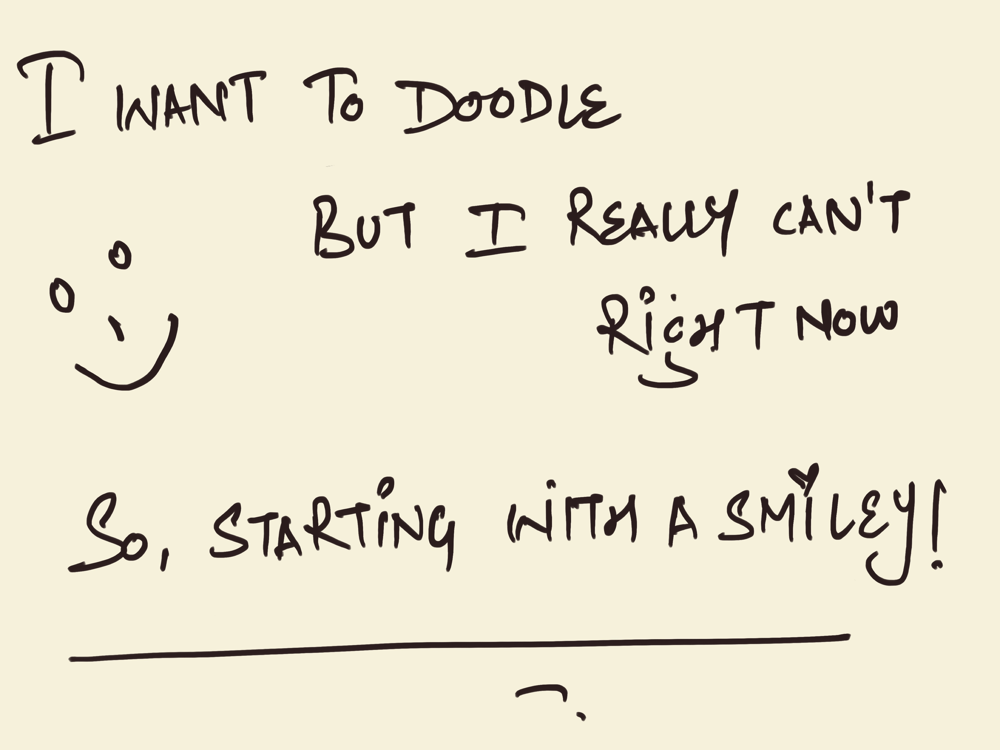

***A space for me, to free myself from the silent struggle of writing a whole blogpost, when I just want to write down a single line of thought.***

***This is my personal journal where I wish (and want) to lay down something everyday!***

---

## *May 27, 2020*

***[23:16] A nice day as whole...***

Work is going good. There is more progress. I'll be taking up some new tasks tomorrow.

The morning started with this nice, hour long recorded live-stream by *[David Neal (ReverentGeek)](https://reverentgeek.com/)* on the [The Benefits of Doodling and Sketching](https://www.youtube.com/watch?v=RZsSe9UDEy4&feature=youtu.be)

After watching this, I was super pumped to draw something, atleast some rough doodles. But, very soon I realised, now I've lost all that skill of art. 

(*I loved painting, sketching, drawing, doodling as a child. Now everything seems soo hard. Sigh!*)

But I still tried, although failed miserably. So, this was the final thing for my peace of mind. XD

I'll try watching some more of these kind of videos, so that hopefully I can start that random drawing thing again. It's a really awesome way to bring back that creativity and joyfulness back.

Next, I watched this super awesome light refreshing talk, *[The Faker You Are, the More Successful You Can Be](https://www.youtube.com/watch?v=bEg5ySTUGxE&feature=youtu.be)* by *Pablo stanely*.

***(This is undoubtedly a must watch. I've already marked it as one of my favorites now.)***

There is more! :D

The day was filled with cool artsy stuffs, coming from all sides today. I'm sure, I was definitely not looking for these, but somehow it just came to me.

If you want to see some *artsy doodly* butt illustrations, this page [https://buttsss.com/](https://buttsss.com/) is entirely filled with them. And they have a [video compilation](https://www.youtube.com/watch?v=jrZD6ECwcqo) too. It's *100%* super duper hilarious. Go have a look! :P

I was just about to call the day off, now. But reliased there is a little 20 mins stuff left. Will quickly finish it & directly jump to bed then. 

Good night o/

---

## *May 26, 2020*

***[23:59] A productive day...***

Today, I worked (hard) a lot & saw some tangible results as well. I'm a few steps closer to the outcome of the tasks (something on which I've been juggling for almost a week now.)
- Meditation, paid off. I was *literally* focused for just doing the office work.
- The sleeps on the weekends, paid off. I was really energetic all throughout the day.
- And the habit of reading good, also paid off. I was determined to learn, understand & actually reach the solution.

Extremely sleepy right now!

I think today, apart from the work related stuff, I haven't watched/read much.

Today's good feed comes from *Ramit Sethi's* morning newsletter, ***1 way to be happier every day***.

*(Couldn't figure out the link, as it's an email newsletter. So, putting here some of the snippets for reference.)*

***I***

>I think we could all use a little more positivity in our lives — and giving out good compliments is a great way to do it.
>
>Not only can you make someone’s day, but it can make you feel better too.

***II***

>In fact, one of the most powerful ways you can make yourself happier is to give a compliment to another person. Not just a nice, throwaway compliment. I'm talking about a meaningful, authentic compliment.

***III***

>(Notice how crappy compliments typically start with “I” whereas good ones focus on the person receiving the compliment.)

***IV***

>But giving someone a compliment is “you focused.” It’s focused on someone else, and that’s why it’s fundamentally different. That happiness lasts for them and for you. 

***V***

*(this one reminds me of [jasonbraganza](https://mjbraganza.com). I learnt this skill just by observing him.)* 

>Once I saw how powerful this was, I actually started trying to give people more compliments. It didn’t come naturally to me, but I’ve been around a number of very successful people and I’ve observed them. And they are just so good. It seems like they are naturals at just making other people around them feel good.

***VI***

>So here are two little tricks I discovered for giving great compliments that other people love, and they will make you feel great too.
>
>- First, focus on the little things.
>- Second, tell people the kind of person that they are.

That's all for the day. I'll jump into bed now (*right as I pack up the work*).

---

## *May 25, 2020*

***[21:52] A holiday more for my brain...***

Another good day. I slept for some more good time, filling up more from my pending sleeps. I feel better & more energetic now. :)

Today, everything was more of actions followed by learnings (which means, I watched/read something, then learned things out of that & then learned something more as an action to it.)

Started the day with this recent *Ramit Sethi*'s ***[Personal finance session with school kids](https://www.youtube.com/watch?v=ZjT2_8CsGXE&feature=youtu.be)***, linked inside *Shane Parrish's Farnam Street Newsletter*.

Apart from all the learnings about money, compound interests, and investments, and this really useful (all about money related) [calculator](https://www.bankrate.com/calculators/savings/compound-savings-calculator-tool.aspx), I got a couple of key points to start applying in my day-to-day life.

- Be a **CEO**!
    - **C:** cut costs.
    - **E:** earn more.
    - **O:** optimize the spendings.
- And then the three simple, yet really powerful life rules to remember.
    - Make your own ***money rules*** (i.e. choose where to spend money without thinking at all. For eg, for buying a book!).
    - Time is your friend (Start saving early, and time will help you grow with it).
    - You decide what your ***rich life*** is (& it is very personal to an individual).

Later then, I jumped to binge read ***[jasonbraganza's](https://toots.dgplug.org/web/accounts/651)*** mastodon feeds (*oh, it certianly is a treasure of all awesome diverse stuff*). Putting down, couple of things from what all I read there.

I started with *Ryan Holiday's* ***[Can You Be Still?](https://ryanholiday.net/can-you-be-still/)***. It basically taught about our (us, we human's) problem with not being able to *"be still"*. So, with *Odysseus (the greatest hero in all of literature)* example, he basically reflect the quoted in nutshell

>Of course, Odysseus isn’t unique. He is us. He’s the human condition in a nutshell. As Blaise Pascal put it, “all of humanity’s problems stem from our inability to sit quietly in a room.” Because we cannot be happy, because we can’t just be, we waste years of our life.
>
>We go begging for trouble. We invent problems. We busy ourselves. We neglect our families. We flee, as Seneca once put it, from ourselves. Then we justify it, pride ourselves on it, point to our restlessness and call it ambition or responsibility.

And then I found this lovely quote from one of [his (jasonbraganza's) toots here](https://toots.dgplug.org/web/statuses/104193723825461247).

>“Burn your wish list. I want to see your commitment list. I want to know what you are committed to doing with your 24 hours a day to close the gap between where you are and where you want to be. What are you willing to sacrifice inside your 86,400 seconds every day to become the person you want to be?!”
>
>Burn Your Goals, Joshua Medcalf

Today, I *literally* meditated for about 25 minutes (not really meditated for 25 minutes, it's just that I did the whole practice for that long) with one of [Tara Barach's meditation stream](http://www.tarabrach.com/audio/2010-07-07-Smile-Meditation-TaraBrach.mp3), again pointed by *[jasonbraganza](https://mjbraganza.com/)* in his recent [Time Management session](https://dgplug.org/irclogs/2020/Logs-2020-05-03-09-30.txt) on #learnandteach.

Also, now, I've decided to log my daily meditation as well, [here](https://priyankasaggu11929.github.io/meditation.html). I really wish it goes well.

Last, I bought & started reading this book ***You Can Be Rich Too*** by *PV Subramanian and M Pattabiraman*.

I thouroughly enjoyed my day! :)

PS: I'm regularly writing my morning pages.

---

## *May 24, 2020*

***[19:58] A relaxing holiday for my brain...***

Today, I did absolutely no work (afterall it *is* sunday & my brain needs break to start with all the weekly hassle again). I so badly waited for this weekend this time. And damn, finally I got it today. \o/

I finished my pending sleep today (truly that makes me sooooo happy for me).

Ok, there is a lot what I read, watched & listened to, from today.

***[The NoFap Legend Sarvesh Shashi | The Ranveer Show 27 | BeerBiceps](https://www.youtube.com/watch?v=x0NTMSFBmv0)***

Although this had nothing to do with me directly (apart from the meditation part which I *should* start), the last 10 minutes gave me some really good points to think over.

*(The male folks might find it interesting.)*

- Be true & authentic to youself. It'll make *living the life* much easier.
- Do self-care (both mentally & physically).
- And the last (& the one I liked the most), be *people's person* (i.e. be someone who is liked, loved, admired & looked after by everyone around).

And also, this one beautiful quote

>Love like there is no tomorrow. And if tomorrow comes, love again!

***[Fear Setting: The Most Important Exercise I Still Do Today | Tim Ferriss](https://www.youtube.com/watch?v=o7EVMjgsSME)***

Here *Tim Ferriss* talks about the most important exercise (as he says & I too found) i.e. **writing down costs of inaction** to easen up a dilemmatic situation.

For example, suppose I've issues with my job & I'm thinking of leaving the job right today.

So, I would right about the costs (or results/outputs) of the possible inactions. First, what will be costs if I leave the job right today, second, what if I stay in the job & leave it after 6 months, etc.

(Quoting a comment from the video)

>Writing down the costs of inaction is genius! It forces your mind to look at things from a different perspective. This is a great thing to do if you are stuck or don't know how to solve a challenge.

***[Should You Specialize or Be a Generalist? | Tim Ferriss](https://www.youtube.com/watch?v=wCPbPMRNnvk)***

(Again, quoting a comment from the video. It basically is the synopsis.)

>Long story short: being a specialist makes sense only if you're extremely good at what you do. If you're not, it's better to be a "**specialized generalist**", which means that you should combine several valuable skills, but not too many. The more rare the combination, the more successful you can be. Tim suggests three easy add-ons to whatever you do: public speaking, writing, and negotiating.
>Another tip from Tim: win, even if you lose. Use the skills you learned and the relationships you built during the launch of a relatively "failed" product to be more productive in the future. Projects come and go, but skills and relationships with good people stay with you.

Oh, and this one is a very good example of the same practice in action.

>I had so many interests growing up and I couldn't decide which one to pursue: psychology, electronic music, photography, computer science... so, I decided to pursue all of them. I did my degree in psychology and my masters in research methods, worked as a photographer on the side and made music and websites for fun. I ended up working as a Data Engineer for an audio focused machine learning company, capitalising on 3/4 of my interests. It doesn't even feel like a job.

***[How To Tie A Perfect Tie... Every Time.](https://www.youtube.com/watch?v=-3IDkvsZ6I0)***

Putting it here, because I went through a nostalgia after watching this. 

My father is the one who taught, ***how to tie a perfect tie-knot*** to all the men on the paternal side of my family (as I heard from the stories). I also learnt it from him when finally I got my first ever actual (school) tie, after the ready-made one (the one I had as a kid which basically has two strings to tie around neck).

***[My Top Travel Tips | Tim Ferriss](https://www.youtube.com/watch?v=dY1OYkOJ0XI&t=2s)***

I have so much in my bucket list now. I wish I could travel the same way (or better) someday in my life. Dreams I want to live! :)

***[How to Network | Tim Ferriss](https://www.youtube.com/watch?v=kMcgWK6LYyc)***

A really insightful video, describing how *Tim Ferriss* did his networking before the launch of his first ever book. He talks about how he approached meetup moderators (mostly neglected & underrated folks) rather than the intended folks directly, for *eliminating the direct asking part* & eventually earning the *first introduction* through a mutual person. And more, it's something to watch again over time.

And finally the last thing, I started this audiobook ***The Obstacle Is The Way*** by *Ryan Holiday*. 

I'll definitely write book notes for this one. Maybe in parts because it has so many amazing instances from great personalities.

---

## *May 23, 2020*

***[16:13] A peaceful day...***

It was a nice early start of the day.

I read book notes of **Permanent Record** by *Edward Snowden*, from [here](https://www.ravinderdeol.com/notes/permanent-record-edward-snowden) & then [here](https://goodbooksummary.com/permanent-record-by-edward-snowden-book-summary/). 

Continued Chapter 3, "How you run Python" of **Learning Python** *by Mark Lutz*. It's a fairly long chapter. I'll take time to finish, might skip a couple of parts too which I'm fairly aware of now.

Followed by this lovely article, [No You’re Not Bragging And Other Tips for Creating Your Resume](https://levelup.gitconnected.com/no-youre-not-bragging-and-other-tips-for-creating-your-resume-23809d8c8d30) by *Dasani Madipalli*. I felt most connected with these words from her (it's exactly something [what I wrote about myself 3 days back](https://priyankasaggu11929.github.io/journal.html#may-20-2020)), 

>Writing personal essays and talking about myself was definitely not my forte (though I guess that is what I am doing right now haha)

And I think this article is going to be my goto recommendation for anyone who is struggling to write their first resume.

Today, I finally finished and posted a 5 months old, pending post about my [Outreachy experience](https://priyankasaggu11929.github.io/outreachy/2020/05/23/Experience-applying-to-Outreachy.html). Which means, now, I have my own set of documented answers to the FAQs, folks usually have before applying to Outreachy Program.

Later, I also watched this FOSDEM'19 talk, [Designing Command-Line Tools People Love](https://www.youtube.com/watch?v=l89Z0RYseFs) by *Carolyn Van Slyck*. It was a nice introductory session about how *to build command-line tools that are not only easy to learn, but something that other developers are willing to maintain.*

And then finally, I had a quick crash session (from work) around the entire kubernetes cluster architecture.

---

## *May 22, 2020*

***[15:21] Finally writing the first half here...***

I woke up early, first at 6, then at 8, did something (maybe scrolled through twitter, or through youtube), started listening to this podcast from [Tim Ferris with Kevin Hart](https://tim.blog/2020/05/20/kevin-hart/), but slept back again in midway and finally then woke up at 10:10 am.

As usual (or actually my 3 days old usual), I started reading chapter 3, "*How you run programs*" from **Learning Python** by Mark Lutz. Finished some 10 pages (5 leaves) and left. Wrote my morning pages (today they actually became late morning pages, but anyways I kept the streak).

Finally after so long, got to talk to my mentor a bit (and that ultimately became my good feed (and the best thing) for the day). :)

Started working late today, around 1:45 pm. I had to prepare, cook & then eat, apart from the time to all the good habits I am trying to build now-a-days.

Mom's got injured yesterday. And so, when I had to do a couple more things with my new usuals, I realised it's hard, it's *real* hard to handle everything at once (although my *everything* was nothing of a big deal, but just to cook some food and that's all). Also, it's not that I don't cook, I actually cook every single day but then at these times mom is well, and so everything looks super cool.

So far, it's going good. :)

***[21:29] Wrapping up early today...***

No good progress today. More research & some more learning. I think this weekend is not gonna be an actual weekend. There is a lot of work. And on top of that, I have a lot to learn first. Sometimes, I feel I don't know anything only, so, how the heck I will ever be a good addition to the team. Everything seems so overwhelmingly complex to me. 

But I still believe everything demands it's proper time & lots of patience & practice, to actually start making some sense. And I'm in the process!

Sometimes it's really important to understand that not everything is *easy*, and not everything can be learnt & applied in the same way as other things. And in these cases, it requires *time*, it requires *focus* & it requires some *deep work* to actually achieve them.

I'm getting more serious about my learnings now. I really need to work hard. I've to keep learning or there is nothing otherwise.

One very critically important thing that I'm slowly realising now, is that I've to keep my *hobbyist learnings* strictly away from my *working hours*. Being happy achieving something in that hobby work doesn't mean that I keep celebrating the happiness for the entire day & not doing my work only. 

***With no damn excuses now, I have to make sure that these distractions are strictly eliminated. Everything, both work and the side projects should have their discrete boxes of time.***

What else from today?

I think social media (although I'm using it for gathering productive resources & healthy networking only) is becoming a *real* distraction now. I can't afford to spend my time there when I'm supposed to work. So, I'll be more intentional about how I spend my time now.

I think I've already laid down a lot of things, to take some immediate *intentional* actions on. So, that is what I'm going to work on now, to make the following days better & more productive. :)

And there is nothing negative about it. It's just that this is the high time for me in my career, and the more sooner I actually start considering these facts, the more better the results would be (for me), later. :)

And the last thing (absolutely just for me)!

The day you move your working setup to your bed, with not a single second thought, do either of the 2 things:

- Take a leave & rest!
- Or JUST GO BACK TO THE DESK & *WORK*!

Ok, I think that's more than enough (for me) for today. 😅️ 😂️

***[23:08] Came back to write this...***

Now, I'm sad. Just because of my bs procastination, I missed uploading a simple cover letter & I lost a really awesome opportunity. A big lesson learnt today, never take your opportunities forgranted, and above that, never procastinate when it comes to stuff like these. Never ever!

---

## *May 21, 2020*

***[10:58] Not so late (but late) start of the day...***

I'm done with writing my morning pages. I'm happy atleast I kept it for the second day now. I hope I'll continue!

Today's good feed comes all the way from *Richard Feynman*. I spent about an hour reading lots of tweets from his twitter account [here](https://twitter.com/ProfFeynman?ref_src=twsrc%5Egoogle%7Ctwcamp%5Eserp%7Ctwgr%5Eauthor). I realised even few words of great wisdom in a sentence teaches enormously.

This one stuck my attention for the most (I even shared in the working slack & few folks thanked me for sharing it there)

***The more you know, the more you know what you don’t know! 
What you know is inside a circle, what you don't know is outside of it. The circumference is what you know you don't know. As your knowledge grows, the circle grows and the circumference expands.***

I'm super proud (yes, ofcourse of myself :p)! I finished reading another chapter "How Python Runs Program" from *"Learning Python by Mark Lutz"* (oh, I still remember the author's name XD).

Today I learnt about *Python's view* of program execution, thus, learnt about *Byte Code Compilation* & *Python Virtual Machine (PVM)*. Then had a brief intro to some of the *Python Implementation Alternative* like:
- CPython (the standard implementation of Python that we mostly encounter as the pre-installed Python in our (linux/mac OS) systems)
- JPython (Python for Java)
- IronPython (Python for .NET)
- Stackless (Python for concurrency)
- PyPy (Python for speed)

Then a little bit about *Execution Optimization Tools* like Cython (a Python C hybrid), Shed Skin (a Python-to-C++ translator) and Pysco (the original just-in-time compiler) which is no longer maintained & mostly logistically incorporated into the more complete PyPy system. And finally ended knowing about *Frozen Binaries* that bundle together the byte code of the program files, along with the PVM (interpreter) & any Python support files the program needs, into a single binary executable program/package.

I'm definitely learning a lot, even from my small reading time. Totally enjoying it!

***[00:02] Wrapping up work now...***

Ok, I was able to work properly (I mean I had my focus in place). Although couldn't finish my stuffs, but I learnt a lot. Today, it was all about setting up the observability part of the stack, thus, more of making grafana dashboards for loki as data-source for metrics, querying logs for certain field specific data.

The entire day went into learning, then re-learning, exploring more & finally just relasing that it was not enough. So, will give another good try tomorrow.

Apart from work, today, a couple of good things happened.

- I got an appreciating message from a friend on twitter, for the [fitness logging](https://priyankasaggu11929.github.io/fitness.html) I do around my weight loss journey. It was a really satisfying feeling for the reason that something like my (fitness) journey could be impressive to others. Truly, it was a happy moment for me. :)
- And then the best thing of the day. I got to have a quick, short & a really extremely wonderful coversation with ***Mark Rushing*** (*Public Cloud IaaS Service Owner, Citi*). I consider reaching out to him as one of the best things I've done so far for myself (this was the first time I actually reached out to someone without knowing them at all). And I think, it was *totally* worth it.

This impromptu meeting happened during the networking hours of the [cloud native virtual festival, "Software Circus: Down the Rabbit Hole"](https://www.softwarecircus.io/). I got to gather a looot in a very short time. All from the intro to the DevOps, the work we do, the culture, tools, platforms, practices we follow, and then some really great resources for learning & pointers to explore, a quick nice bit about jobs & corresponding requirements, fundamentals around the domain & I think a lot more too. The biggest takeway was his teachings around the importance of collaboration & communication (especially in DevOps). He was incredibly nice with his time, words & guidance, and with sharing his life & work experience around many things. It couldn't have been any better in that short period of time.

Lastly, I was happy today because I touched my second goal weight & turned an year younger in my metabolic age, on the scale. Although that way I'm still 6 years older than my actual age, but there are improvements & I take them as my small & steady wins. :)

It was a good day overall!

---

## *May 20, 2020*

***[09:48] A good start of the day...***

Watched a video about [evening routine of Tim Ferris](https://www.youtube.com/watch?v=eLYqhezACpc). I really have no idea if I could follow it any time soon in my life, but maybe someday I can come up with my own version of it. (Sadly, I'm missing the idea around that video and getting highly deviated towards *working hard* to get that much of luxury life someday. Actually yes, that *is* my plan :D )

Today's good feed happened just out of nowhere. I was reading one of the tweets around #100daysofJobSearch, and I found this *Ramit Sethi's* video on [How to write a Winning Resume](https://www.youtube.com/watch?v=_0fjkKCsM1w) in one of the threads. Although, I didn't see myself writing a new resume anytime before watching this video. Now, I think I'll definitely go back and check where I can improve (While I'm actually a little happy with the way my current resume is, because I see that also includes a little narrative. Certainly, I don't think that is the best one, but definitely the best one I've come up with, so far & feel quite confident while sharing. I'm actually looking forward to improving it with the learnings from *Ramit Sethi's* (dated) resume. Yes, his dated resume also speaks a *looot*.)

It's just the start of the day & I think I already have my first best thing. Ah, actually 2 best things.
- I wrote my first **morning pages**. It's totally worth it. I know it's just the first day of writing it. But I'm totally fascinated by the way how I laid down all my running thoughts in multiple pages, in absolutely no time at all. No thinking required, nothing. Just wrote everything I felt like writing & done!
- I started reading **learning Python** by *Mark Lutz* (I admit I wouldn't have recalled the author's name at all, if in that one paragraph where he started like *"After using it for 21 years, writing about it for 18, and teaching it for 16, I've found..."*, my attention just went onto looking for who is this *"I"* here & I checked the author's name. Not really proud, but yes, that's how I remember the author's name XD). I'm done reading the first chapter *"A Python Q&A session"* & have just started with the second one, *"How Python Runs Programs"*. The best part was that I read it without getting distracted at all. I read around 11 leaves (22 pages) in one hour & that's the maximum for me so far. :)

(*Okay, honestly speaking, the intent for reading the book was not to learn Python, but just to start reading some book. I know a little bit of Python to get my work done somehow, definitely after tinkering for almost everything on internet. But now, I think It's interesting to know the fundamentals, to get to know about things that I never knew before. For instance,  Python is named after the British Comedy group, Monty Python. So, now, I look forward to learning more about the technical fundamentals as I read it through (hopefully).*)

And thanks jasonbraganza, for the book (and books). I finally started reading it today.

***[11:06] Finally logged off from work...***

Very sleepy now. Not a productive working day. Kept struggling all day to focus & finally when I managed to focus, my body just started feeling super sleepy.

Wrote my first ever cover letter today. I'm happy the way it turned out. But I admit, writing resume or a cover letter or an essay type application is still really very hard for me. I loose all my vocabulary (whatsoever I have at other times) when I've to write about my own experiences, skills & stuff. But I think a work commitment helps here. It just bound me to do the work.

Apart from that, today I finally went back to a couple of folks, expressing my long pending gratitude for the help, guidance & pointers I'd received from them in past months. I realise a simple vote of thanks makes both the ends really happy & acknowledged. :)

It would have been much better today, if I had proper focus during the working hours. Just lacked some self-motivation to work. But actually it's ok. Today was one such odd lazy day. Hopefully, I will do better tomorrow!

---

## *May 19, 2020*

Trying to build this habit of feeding my brain with something good (and something that I can start applying to improve me) every morning now.

Today's good feed: [How I Journal and Take Notes | Brainstorming + Focusing + Reducing Anxiety | Tim Ferriss](https://www.youtube.com/watch?v=UFdR8w_R1HA)

And the takeaways:
- Do crazy quick brainstorming with yourself, to lay down all the crazy quick thoughts on some specific usecase.
- Writing ***morning Pages*** (for reducing anxiety at the very start of day itself).
- Discrete bullet points for, `what went well during the day?`, `what I'm grateful to?` and `How could I've made today better?`.
- And last, doing all 3 of them at one time is not required. But just one at a time will definitely help in future.

I'm still thinking what parts I can include here itself but *morning pages* is what I'm definitely looking to move forward with.

***[00:39] Finishing the day now...***

Fortunately, Office hours were peaceful today. Although leaving very late, but have finished all my tasks for the day.

Happy that finally my concepts are getting nicely cleared.

The best thing from the day is that I've finally gained some muscles today with equivalent fat loss.

I still missed my personal work commitments. Need to really prioritise them in life.

---

## *May 18, 2020*

Started the day with the audio-book ***[The Subtle Art of Not Giving a F*ck](https://www.youtube.com/watch?v=uFZjtyJ10x8)*** by *Mark Manson*.

I wanted to write down my own book notes for the sake of my memory, but couldn't figure out how to do that while listening to an audio book. So, for now will be using my mentor's notes from [here](https://mjbraganza.com/the-subtle-art-of-not-giving-a-f-ck/#fnref:1). 

The office working hours were peaceful today. I finished most of my tasks. Also came across this repository [kubernetes-the-hard-way](https://github.com/kelseyhightower/kubernetes-the-hard-way) for expanding my little kubernetes knowledge onto really deeper architecture's side (a senior colleague pointed this out).

Today was a busy day. Hopefully, will slowly start implementing this from tomorrow.

Just came across [this tweet](https://twitter.com/IanColdwater/status/1262237918309109760). Reminded me once again that I've to be really thoughful about my own decisions too.

---

## *May 17, 2020*

Finally, I have my personal journal space.

After seeing the [fitness](https://priyankasaggu11929.github.io/fitness.html) page getting slowly filled with something to read from my own life, now, I feel I should have a space for writing my all other bitter-sweet moments (from my life) too.

I'm feeling really positive about it. It's because somehow I've ***finally*** build-up this feeling that I *should* write ***just for myself*** too (*Just to keep myself motivated & my future-self aware of the things happening right now.*)

Besides, today I started my day with [this podcast](https://overcast.fm/+Kebtj4G94) from *Tim Ferris with Elizabeth Gilbert*. And my biggest takeaway was this extremely useful phrase/reply, **Thank you and no!**

(*A simple phrase meant to save me from giving any explanations/reasons to the extra-smart-manipulative people while answering them, a straightaway gentle no!*) 
